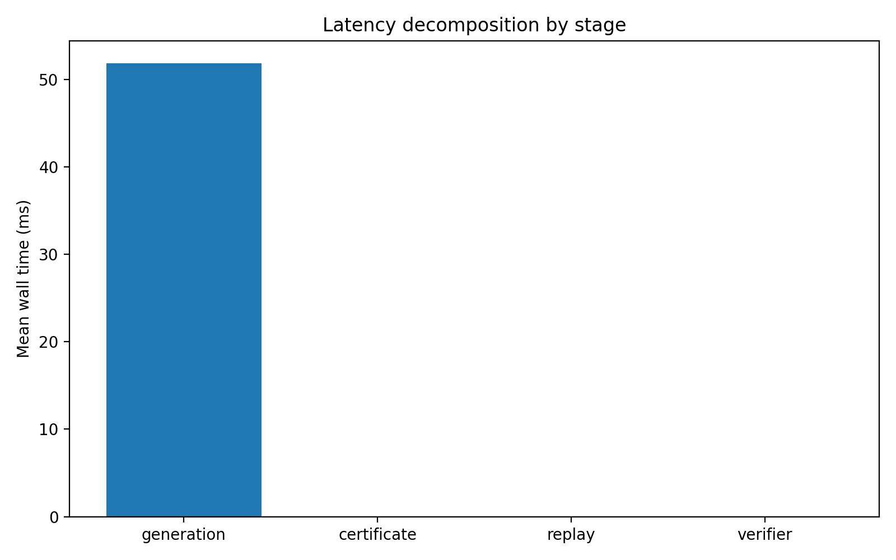

# Proof-Carrying Generation for Agentic AI (PCG-MAS)

Reproducible scaffold for proof-carrying multi-agent evaluation with certificate construction, replay checking, telemetry, overhead analysis, and healthcare-oriented stress-testing.

- Multi-stage telemetry: generation, certificate, replay, verifier
- Overhead analysis with token/latency summaries
- Healthcare-oriented evaluation adapters (MedMCQA / MedQA path)
- Publication-style plots and reproducible local + Colab workflow

---

## Project map & methodology cheat-sheet

This README mirrors the structure of the reference repo style while reflecting the current `proof-carrying-multi-agents` repository and its rebuilt experimental scaffold.

### Repository overview

- **Repository root:** `/Users/supratiksarkar/work/proof-carrying-multi-agents`
- **Primary goal:** evaluate proof-carrying acceptance, replayability, and operational overhead in controlled LLM-driven pipelines.
- **Main outputs:** run JSONL logs, per-run summary CSVs, aggregate overhead tables, and README-ready figures.
- **Current tracked file count (approx.):** 100

### Theory glossary (files → quantities)

| File                               | Quantity / Symbol                                         | Short description                                                                                 |
|:-----------------------------------|:----------------------------------------------------------|:--------------------------------------------------------------------------------------------------|
| `src/common/telemetry.py`          | `StageStats`, `ExampleTelemetry`                          | Telemetry containers for per-stage latency, tokens, and acceptance-related logging.               |
| `src/common/token_count.py`        | `prompt_tokens`, `completion_tokens`, `total_tokens`      | Tokenizer-based accounting used for overhead and token-cost analysis.                             |
| `src/pcg/certificates.py`          | `claim`, `certificate_hash`, `minimal_support_ids`        | Builds proof-carrying certificates with normalized evidence, hashes, and minimal support subsets. |
| `src/pcg/checker.py`               | `Check(Z; G_t)` proxy                                     | Replay-style checker that validates certificate structure, support IDs, and certificate hashes.   |
| `src/pcg/verifier.py`              | `risk`, `score`, `pred_idx`                               | Maps model output to a candidate answer and computes a verifier confidence / risk signal.         |
| `src/pcg/decision.py`              | `answer / refuse`                                         | Risk-aware acceptance rule used to decide whether an answer is accepted.                          |
| `scripts/run_eval.py`              | `accepted`, `answer_correct`                              | Main evaluation loop that produces run-level JSONL artifacts.                                     |
| `scripts/summarize_runs.py`        | `mean_total_wall_ms`, `accepted_accuracy`                 | Per-run summary builder used for README-facing tables.                                            |
| `scripts/aggregate_overhead.py`    | `token_overhead_ratio_vs_posthoc`                         | Aggregates overhead metrics across modes into a single comparison table.                          |
| `scripts/make_figures.py`          | `latency_breakdown`, `quality_overview`                   | Builds README-ready figures from run logs and summary statistics.                                 |
| `outputs/runs/*.jsonl`             | `run_id`, stage logs                                      | Raw run artifacts used as the source of truth for tables and plots.                               |
| `outputs/tables/overhead_main.csv` | `acceptance_rate`, `answer_accuracy`, `latency`, `tokens` | Aggregate overhead table across PCG and baseline modes.                                           |

### Key modules (implementation map)

- `src/common/` → telemetry, timers, token accounting, JSONL logging
- `src/data/` → dataset adapters
- `src/pcg/` → prover, certificates, checker, verifier, decision logic
- `scripts/` → run, summarize, aggregate, plot, and README generation workflows
- `outputs/` → generated runs, tables, and figures

### Repository tree (depth-limited)

```text
configs/
├── 2wiki.yaml
├── default.yaml
├── hotpotqa.yaml
├── medmcqa.yaml
├── medqa.yaml
├── tmp_baseline_lightweight_citation.yaml
├── tmp_baseline_multiagent_no_cert.yaml
├── tmp_baseline_posthoc_verify.yaml
├── tmp_baseline_selective.yaml
└── tmp_pcg_full.yaml

scripts/
├── aggregate_overhead.py
├── build_final_readme.py
├── build_readme_report.py
├── make_figures.py
├── run_eval.py
├── run_healthcare.py
├── run_overhead.py
└── summarize_runs.py

src/
├── common
│   ├── __pycache__
│   │   ├── __init__.cpython-312.pyc
│   │   ├── env.cpython-312.pyc
│   │   ├── jsonl_logger.cpython-312.pyc
│   │   ├── telemetry.cpython-312.pyc
│   │   ├── timers.cpython-312.pyc
│   │   └── token_count.cpython-312.pyc
│   ├── __init__.py
│   ├── env.py
│   ├── jsonl_logger.py
│   ├── telemetry.py
│   ├── timers.py
│   └── token_count.py
├── data
│   ├── __pycache__
│   │   ├── __init__.cpython-312.pyc
│   │   ├── adapters.cpython-312.pyc
│   │   ├── medmcqa_adapter.cpython-312.pyc
│   │   └── medqa_adapter.cpython-312.pyc
│   ├── __init__.py
│   ├── adapters.py
│   ├── medmcqa_adapter.py
│   └── medqa_adapter.py
└── pcg
    ├── __pycache__
    │   ├── __init__.cpython-312.pyc
    │   ├── baselines.cpython-312.pyc
    │   ├── certificates.cpython-312.pyc
    │   ├── checker.cpython-312.pyc
    │   ├── decision.cpython-312.pyc
    │   ├── prover.cpython-312.pyc
    │   └── verifier.cpython-312.pyc
    ├── __init__.py
    ├── baselines.py
    ├── certificates.py
    ├── checker.py
    ├── decision.py
    ├── prover.py
    └── verifier.py

outputs/
├── figures
│   ├── run_00c17b99_latency_breakdown.png
│   ├── run_00c17b99_token_hist.png
│   ├── run_1893108d_latency_breakdown.png
│   ├── run_1893108d_token_hist.png
│   ├── run_1d83c544_latency_breakdown.png
│   ├── run_1d83c544_token_hist.png
│   ├── run_50b7fde3_latency_breakdown.png
│   ├── run_50b7fde3_token_hist.png
│   ├── run_7eee4e28_latency_breakdown.png
│   ├── run_7eee4e28_token_hist.png
│   ├── run_c128fc29_latency_breakdown.png
│   ├── run_c128fc29_token_hist.png
│   ├── run_cf7da0dc_latency_breakdown.png
│   ├── run_cf7da0dc_token_hist.png
│   ├── run_e472c057_latency_breakdown.png
│   └── run_e472c057_token_hist.png
├── runs
│   ├── run_00c17b99.jsonl
│   ├── run_1893108d.jsonl
│   ├── run_1d83c544.jsonl
│   ├── run_50b7fde3.jsonl
│   ├── run_7eee4e28.jsonl
│   ├── run_c128fc29.jsonl
│   ├── run_cf7da0dc.jsonl
│   └── run_e472c057.jsonl
├── tables
│   ├── overhead_main.csv
│   ├── run_00c17b99_summary.csv
│   ├── run_1893108d_summary.csv
│   ├── run_1d83c544_summary.csv
│   ├── run_50b7fde3_summary.csv
│   ├── run_7eee4e28_summary.csv
│   ├── run_c128fc29_summary.csv
│   ├── run_cf7da0dc_summary.csv
│   └── run_e472c057_summary.csv
└── .DS_Store
```

## File-type distribution

Total files scanned: **100**

| extension   |   count |
|:------------|--------:|
| .py         |      25 |
| .png        |      19 |
| .pyc        |      17 |
| .yaml       |      10 |
| .csv        |       9 |
| .jsonl      |       8 |
| .pdf        |       3 |
| [no_ext]    |       3 |
| .md         |       2 |
| .txt        |       2 |
| .example    |       1 |
| .ipynb      |       1 |

## Latest result highlights

### 1. Latency Breakdown


This figure decomposes end-to-end runtime into generation, certificate construction, replay validation, and verifier scoring.

### 2. Latency Distribution Across Stages
_No figure found._

This figure shows stage-wise variability and outliers instead of only mean latency.

### 3. Token Distribution
_No figure found._

This figure summarizes token-cost variability across examples and highlights whether cost is stable or tail-heavy.

### 4. Quality Overview
_No figure found._

This figure summarizes acceptance rate, overall accuracy, accepted-answer accuracy, and verifier confidence.

## Aggregate overhead table

| dataset   | mode                          |   acceptance_rate |   answer_accuracy |   mean_total_tokens |   mean_latency_query_ms |   generation_ms |   certificate_ms |   replay_ms |   verifier_ms |   token_overhead_ratio_vs_posthoc |
|:----------|:------------------------------|------------------:|------------------:|--------------------:|------------------------:|----------------:|-----------------:|------------:|--------------:|----------------------------------:|
| medmcqa   | pcg_full                      |                 1 |              0.1  |               85.8  |                 52.6575 |         52.5434 |                0 |      0.0281 |        0.0076 |                            1      |
| medmcqa   | baseline_multiagent_no_cert   |                 1 |              0.1  |               85.8  |                 50.6479 |         50.6312 |                0 |      0      |        0.0167 |                            1      |
| medmcqa   | baseline_lightweight_citation |                 1 |              0.1  |               85.8  |                 51.1604 |         51.1434 |                0 |      0      |        0.017  |                            1      |
| medmcqa   | baseline_posthoc_verify       |                 1 |              0.1  |               85.8  |                 51.5812 |         51.5648 |                0 |      0      |        0.0164 |                            1      |
| medmcqa   | pcg_full                      |                 1 |              0.15 |               82.3  |                 44.6902 |         44.5826 |                0 |      0.0271 |        0.0062 |                            0.9592 |
| medmcqa   | pcg_full                      |                 1 |              0.15 |               82.3  |                 49.0161 |         48.9102 |                0 |      0.0274 |        0.0058 |                            0.9592 |
| medqa     | pcg_full                      |                 1 |              0.3  |              227.05 |                 55.987  |         55.8854 |                0 |      0.0253 |        0.0059 |                          nan      |
| medmcqa   | baseline_selective            |                 1 |              0.1  |               85.8  |                 51.8786 |         51.8619 |                0 |      0      |        0.0168 |                            1      |

## Submission snapshot

- **Stage:** local rebuild completed; Colab/GPU phase still pending
- **Current model path:** open-source Hugging Face models through local script-first execution
- **Current datasets:** MedMCQA pipeline active; MedQA path scaffolded
- **Artifacts generated:** run logs, per-run tables, aggregate overhead table, and README-ready figures
- **Intended next stage:** Colab-backed reruns with stronger backbones and fuller overhead/healthcare reporting

## Why numbers may differ

- Local CPU/MPS runs and later Colab GPU runs can differ in runtime, tokenization edge-cases, and model generation behavior.
- Public dataset loaders and package versions may introduce small changes in row ordering or field behavior.
- The current backend is a rebuilt scaffold and still evolving; certificate/checker/verifier logic may strengthen further before final experimental reporting.
- Figures and tables in this README reflect the currently generated local artifacts, not yet the final Colab-scale experimental pass.

## Interim READMEv1 content (merged)

> The following block preserves and merges the previously generated READMEv1 content.

# Proof-Carrying Multi-Agents — READMEv1

This is an interim report page generated before the Colab/GPU stage.

## Included in this snapshot
- runtime telemetry
- certificate construction and replay checks
- healthcare-oriented evaluation adapters
- overhead analysis
- publication-style plots and summary tables

## Latest Result Highlights

### 1. Latency Breakdown


This figure decomposes end-to-end runtime into generation, certificate construction, replay validation, and verifier scoring.

### 2. Latency Distribution Across Stages
_No figure found._

This figure shows spread and outliers in latency across examples for each stage.

### 3. Token Distribution
_No figure found._

This figure summarizes how token usage is distributed across examples and highlights typical versus tail-heavy cost behavior.

### 4. Quality Overview
_No figure found._

This figure summarizes acceptance rate, overall accuracy, accepted-answer accuracy, and verifier confidence in one place.

## Aggregate Overhead Table

| dataset   | mode                          |   acceptance_rate |   answer_accuracy |   mean_total_tokens |   mean_latency_query_ms |   generation_ms |   certificate_ms |   replay_ms |   verifier_ms |   token_overhead_ratio_vs_posthoc |
|:----------|:------------------------------|------------------:|------------------:|--------------------:|------------------------:|----------------:|-----------------:|------------:|--------------:|----------------------------------:|
| medmcqa   | pcg_full                      |                 1 |              0.1  |               85.8  |                 52.6575 |         52.5434 |                0 |      0.0281 |        0.0076 |                            1      |
| medmcqa   | baseline_multiagent_no_cert   |                 1 |              0.1  |               85.8  |                 50.6479 |         50.6312 |                0 |      0      |        0.0167 |                            1      |
| medmcqa   | baseline_lightweight_citation |                 1 |              0.1  |               85.8  |                 51.1604 |         51.1434 |                0 |      0      |        0.017  |                            1      |
| medmcqa   | baseline_posthoc_verify       |                 1 |              0.1  |               85.8  |                 51.5812 |         51.5648 |                0 |      0      |        0.0164 |                            1      |
| medmcqa   | pcg_full                      |                 1 |              0.15 |               82.3  |                 44.6902 |         44.5826 |                0 |      0.0271 |        0.0062 |                            0.9592 |
| medmcqa   | pcg_full                      |                 1 |              0.15 |               82.3  |                 49.0161 |         48.9102 |                0 |      0.0274 |        0.0058 |                            0.9592 |
| medqa     | pcg_full                      |                 1 |              0.3  |              227.05 |                 55.987  |         55.8854 |                0 |      0.0253 |        0.0059 |                          nan      |
| medmcqa   | baseline_selective            |                 1 |              0.1  |               85.8  |                 51.8786 |         51.8619 |                0 |      0      |        0.0168 |                            1      |

## Reproducibility

Typical commands:

```bash
PYTHONPATH=. python scripts/run_eval.py --config configs/medmcqa.yaml
PYTHONPATH=. python scripts/run_healthcare.py
PYTHONPATH=. python scripts/run_overhead.py
PYTHONPATH=. python scripts/aggregate_overhead.py
```


## Diagnostics

Typical commands:

```bash
PYTHONPATH=. python scripts/run_eval.py --config configs/medmcqa.yaml
PYTHONPATH=. python scripts/run_healthcare.py
PYTHONPATH=. python scripts/run_overhead.py
PYTHONPATH=. python scripts/aggregate_overhead.py
PYTHONPATH=. python scripts/make_figures.py --run outputs/runs/<run_file>.jsonl
```

## Compute environments

- **Local development:** MacBook Pro environment via `.venv`
- **Planned replication / scale-up:** Google Colab GPU runtime
- **Goal:** align local debug runs with later Colab-backed experimental reruns
