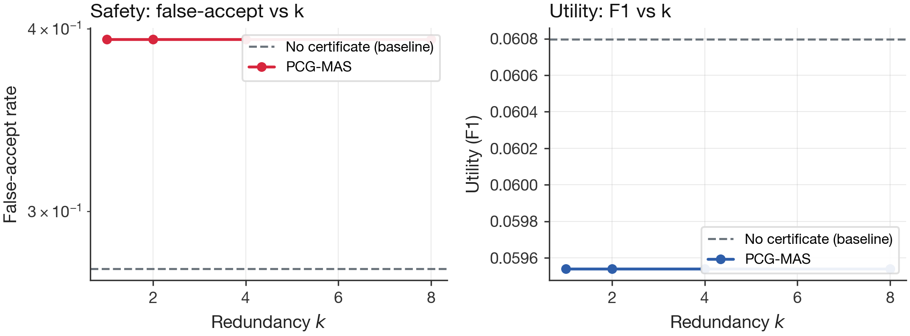
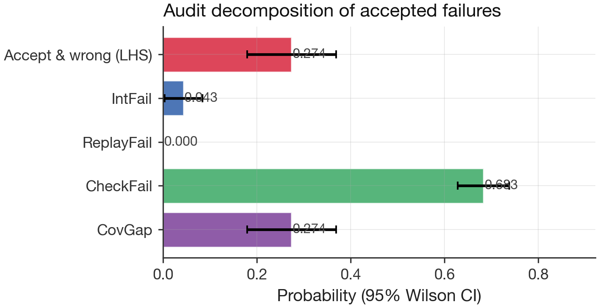
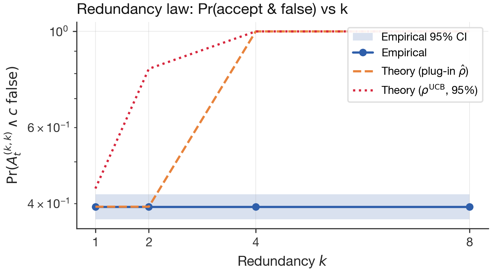
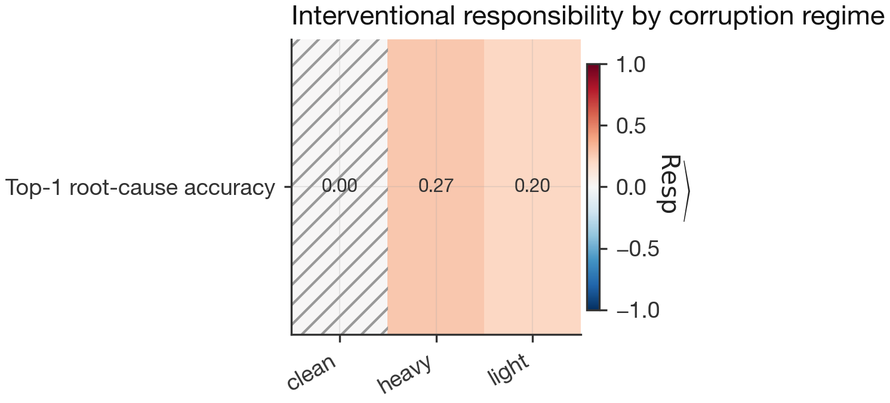
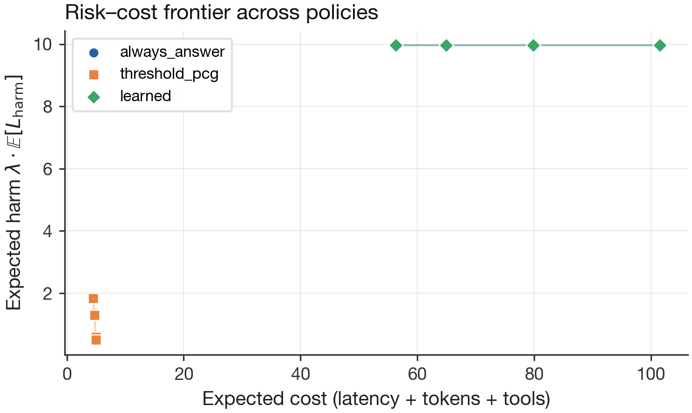
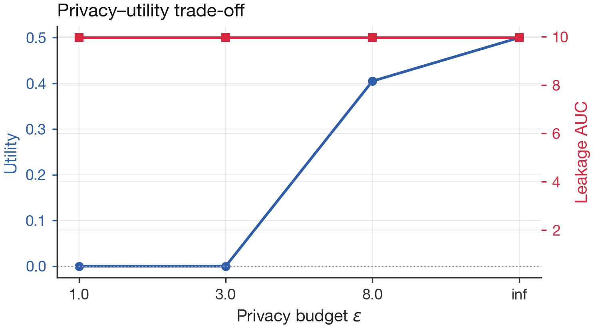
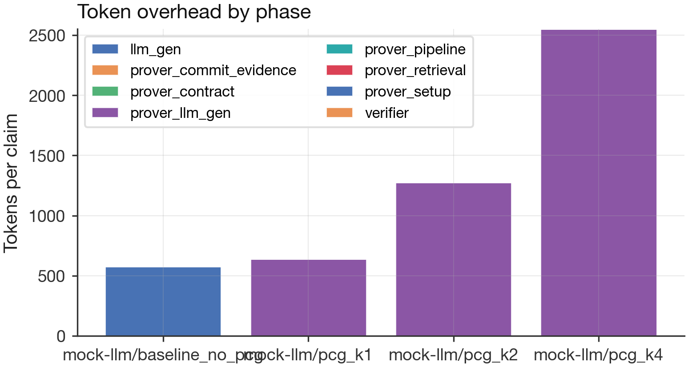

# PCG-MAS — Proof-Carrying Generation for Multi-Agent Systems

> Companion artifact for **"Multi-Agent Systems with Proof-Carrying Generation"** (NeurIPS 2026).
> Every accepted claim ships with a portable certificate `Z = (c, S, Π, Γ, p, meta)`
> that an external auditor can replay and verify without re-running the model.

## Repository Overview

- **Primary goal.** Make multi-agent LLM systems *externally checkable*: every claim is
  accompanied by a self-contained grounding certificate (committed evidence + replayable
  pipeline + execution contract + calibrated confidence) that any auditor can verify.
- **Main outputs.** Five empirical results — R1 audit decomposition, R2 redundancy law,
  R3 responsibility / diagnosis, R4 risk-aware control under DP, R5 token / latency
  overhead — plus the full theoretical scaffolding (Theorems 1–3) implemented as
  property-tested Python modules.
- **Current tracked file count (approx.).** 72 files across source, tests,
  configs, scripts, and docs (excluding `.git`, build/cache directories, virtualenvs,
  and generated `results/` and `figures/`).

## Quick Start

```bash
# 1. Clone, create venv, install
git clone <repo>
cd pcg-neurips2026
python3.12 -m venv multi-agents
source multi-agents/bin/activate
pip install -e ".[dev]"

# 2. Smoke-test the core layer (no model download)
python scripts/test_phase_bc.py            # commitments, BM25, audit decomp
python scripts/test_phase_d.py             # orchestrator + all four agents
pytest tests/ -v                           # property tests for Check / rho / risk

# 3. Run the five experiments (mock backend = fast iteration, no GPU needed)
make smoke                                 # ~30 s
make r1                                    # audit decomposition (Thm 1)
make r2                                    # redundancy law       (Thm 2)
make r3                                    # responsibility       (Thm 3 i)
make r4                                    # risk + privacy       (Thm 3 ii)
make r5                                    # token/time overhead

# 4. Build paper artifacts (figures + LaTeX tables + intro hero)
make paper                                 # writes figures/ and docs/tables/

# 5. Regenerate this README with live stats
make readme
```

> **Tip — backends.** Configs default to `hf_local` with Qwen2.5-7B. Override with
> `--backend mock` for instant iteration or `--backend hf_inference` to compare against
> Llama-3.3-70B via the free HF Inference API (rate-limited, cached aggressively under
> `.cache/hf_inference/`).

## Theoretical Quantity Map

How each module realizes a specific symbol or theorem from the paper.

| File | Theoretical quantity | Brief description |
|:---|:---|:---|
| `src/pcg/graph.py` | $G_t = (V, E)$ — typed runtime graph | First-class `TruthNode`, `ToolCallNode`, `SchemaNode`, `DelegationEdge`; provenance for every claim. |
| `src/pcg/commitments.py` | $H(\cdot)$, Merkle audit log | Collision-resistant hash and append-only Merkle log for all evidence. |
| `src/pcg/certificate.py` | $Z = (c, S, \Pi, \Gamma, p, \text{meta})$ | Immutable grounding certificate with deterministic JSON canonicalization. |
| `src/pcg/checker.py` | $\mathrm{Check}(Z; G_t)$ | The four-channel verification predicate. |
| `src/pcg/independence.py` | $(\delta, \kappa)$-independence | Provenance-disjoint + low-overlap branch independence test. |
| `src/pcg/responsibility.py` | $\mathrm{Resp}_v(F; do)$ | Causal interventional responsibility with Hoeffding CIs. |
| `src/pcg/risk.py` | $r(b, Z)$, $\tau$-policy | Posterior-risk computation and piecewise-threshold optimal action. |
| `src/pcg/privacy.py` | $(\varepsilon, \delta)$-DP | Gaussian mechanism for releasing aggregate features. |
| `src/pcg/eval/audit.py` | Theorem 1 decomposition | Empirical estimation of the four union-bound channels. |
| `src/pcg/eval/rho.py` | $\rho \geq 1$ dependence factor | Clopper–Pearson UCB on $\rho$ with Bonferroni-split $\alpha$. |
| `src/pcg/eval/stats.py` | Wilson, Hoeffding, bootstrap | Statistical CIs used everywhere. |
| `src/pcg/eval/meter.py` | Token / latency overhead | Per-phase `Meter` context manager; backbone of R5. |
| `src/pcg/orchestrator/langgraph_flow.py` | Multi-agent flow | LangGraph dynamic routing — directly answers ICML W2 ("rigid roles"). |
| `src/pcg/orchestrator/replay_handlers.py` | Deterministic replay ops | BM25, span extract, NLI filter, schema validate. |
| `src/pcg/agents/prover.py` | Prover agent — builds $Z$ | Retrieval + LLM call + commitment + contract assembly. |
| `src/pcg/agents/verifier.py` | Verifier agent — runs Check | Plus optional Merkle prefix audit. |
| `src/pcg/agents/attacker.py` | Soundness probes | Evidence-swap, schema-break, policy-violation perturbations. |
| `src/pcg/agents/debugger.py` | Diagnosis + risk choice | Theorem 3: identify root-cause + select action. |

## Featured Plots

The figures below are regenerated from `results/*/r*.json` by `make paper`.
If they don't render, run the experiments first (or `make smoke` to populate
`results/smoke/`).

<p align="center">
  
</p>

<table>
<tr>
<td align="center"><b>R1 — Audit decomposition</b><br/>

</td>
<td align="center"><b>R2 — Redundancy law</b><br/>

</td>
</tr>
<tr>
<td align="center"><b>R3 — Responsibility</b><br/>

</td>
<td align="center"><b>R4 — Risk Pareto</b><br/>

</td>
</tr>
<tr>
<td align="center"><b>R4 — Privacy / utility</b><br/>

</td>
<td align="center"><b>R5 — Overhead breakdown</b><br/>

</td>
</tr>
</table>

> Animated walk-throughs (if any) live in `figures/animations/`. Drop a `.gif`
> there with the same stem as a static figure (e.g. `r3_responsibility.gif`)
> and it will be picked up automatically the next time you run `make readme`.

## Key Modules — Implementation Map

The most important entry points in the codebase, with their public APIs and what they do.

| Module | Key API | Purpose |
|:---|:---|:---|
| `pcg.backends.MockBackend` | `MockBackend().generate(prompt, ...)` | Deterministic, zero-dep LLM stub used by smoke tests and CI. |
| `pcg.backends.hf_local.HFLocalBackend` | `HFLocalBackend(model_name="Qwen/Qwen2.5-7B-Instruct")` | Local Transformers backend, default for paper experiments. |
| `pcg.backends.hf_inference.HFInferenceBackend` | `HFInferenceBackend(model_name="meta-llama/Llama-3.3-70B-Instruct")` | Free-tier HF Inference API for frontier-model comparison. |
| `pcg.datasets.load_dataset_by_name` | `load_dataset_by_name("hotpotqa", n_examples=200)` | Streaming loaders for HotpotQA, 2WikiMultihopQA, ToolBench-G1, synthetic. |
| `pcg.retrieval.BM25Index` | `BM25Index.build(items).search(q, top_k=4)` | Deterministic BM25, replayable from a committed evidence pool. |
| `pcg.checker.Checker` | `Checker(entailment, replayer).check(cert, graph)` | The four-channel verification predicate. Returns `CheckResult`. |
| `pcg.orchestrator.run_one_example` | `run_one_example(ex, backend=..., checker=..., cfg=...)` | Top-level entry point — runs Prover/Verifier/Attacker/Debugger as configured. |
| `pcg.orchestrator.build_replayer_with_handlers` | `build_replayer_with_handlers()` | Replayer with `bm25_retrieve_replay`, `span_extract`, `nli_filter`, `schema_validate` registered. |
| `pcg.agents.build_default_prover` | `build_default_prover(backend=..., config=ProverConfig(...))` | Closes over a backend and returns a `PCGState -> PCGState` callable. |
| `pcg.responsibility.ResponsibilityEstimator` | `est.estimate_many(cert, graph, comp_ids)` | Hoeffding-bounded interventional Resp per component. |
| `pcg.risk.ThresholdPolicy` | `ThresholdPolicy(cost_model).choose(r)` | Piecewise-threshold optimal action over `{Answer, Verify, Escalate, Refuse}`. |
| `pcg.privacy.gaussian_mechanism` | `gaussian_mechanism(x, sensitivity, epsilon, delta)` | Aggregate-feature DP release used in R4. |
| `pcg.eval.plots` | `plot_rN_*(...)` | NeurIPS-grade figure builders. Used by `make_figures.py`. |

## File Type Distribution

_Generated on: **2026-04-25 04:28:35 AOE (UTC-12)**_  \
_Git SHA: `unknown`_

| Extension | Count | Percentage |
|:---|---:|---:|
| `.py` | 55 | 76.4% |
| `.yaml` | 6 | 8.3% |
| `.tex` | 5 | 6.9% |
| `.json` | 2 | 2.8% |
| `Makefile` | 1 | 1.4% |
| `.toml` | 1 | 1.4% |
| `.md` | 1 | 1.4% |
| `(no ext)` | 1 | 1.4% |

**Total number of files canned:** **72**

## Submission Snapshot

The exact code/assets used at submission time are archived in the GitHub Release
**"Submission April 2026"**. The default branch may contain replication notebooks
and small fixes for future runs; pin to the release tag for bit-exact reproduction
of the paper results.

```bash
git fetch --tags
git checkout submission-2026-04
```

Reviewers reproducing the paper artifacts should:
1. Check out the submission tag.
2. Run `make smoke` (≤ 30 s) to verify the toolchain.
3. Run `make r1 r2 r3 r4 r5` (a few hours total on a single GPU; longer for the
   `hf_inference` 70B comparison).
4. Run `make paper` to regenerate every figure and LaTeX table from the saved JSONs.

---

*This README was auto-generated by `scripts/build_readme.py` on 2026-04-25 04:28:35 AOE (UTC-12). To regenerate, run `make readme` from the project root.*
