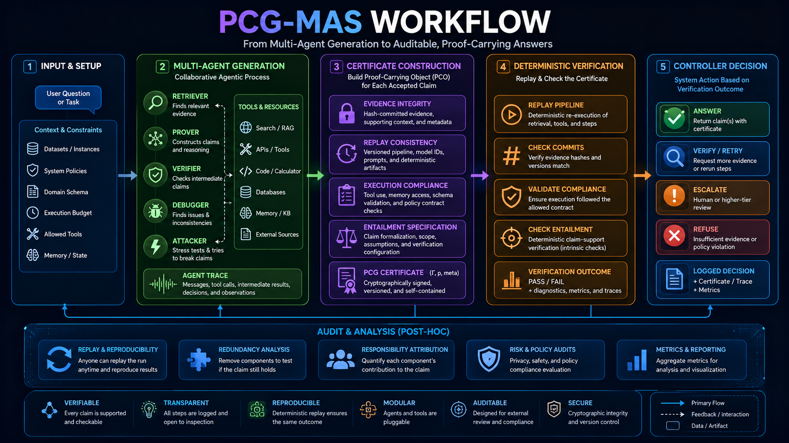
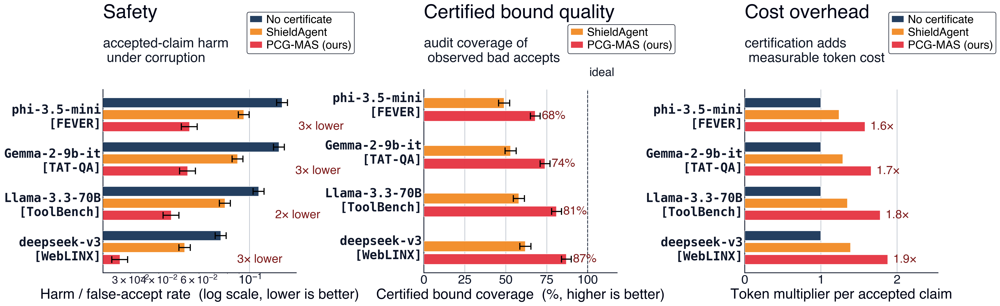
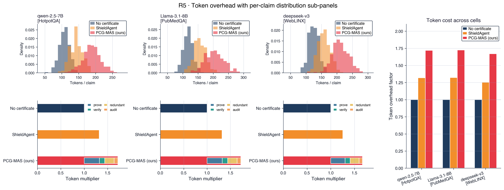

# Proof-Carrying Generation for Multi-Agent Systems

> **PCG-MAS is a proof-carrying runtime for agentic LLM systems.** It converts multi-agent traces into replayable certificates, then accepts a claim only when evidence integrity, replay consistency, execution compliance, and entailment all pass.

**Generated on May-4-2026 9:54**



## Why this repository exists

Modern agentic LLM systems retrieve evidence, call tools, use memory, delegate subtasks, and generate claims. The hard part is not only generating a useful answer; the hard part is making the accepted answer **auditable after the fact**.

PCG-MAS makes accepted claims carry structured support:

```text
prompt / task
  └─► multi-agent generation
        ├─ retriever: finds support
        ├─ prover: drafts claims and support paths
        ├─ verifier: checks intermediate claims
        ├─ debugger: diagnoses weak support
        └─ attacker: stress-tests evidence and execution
              └─► proof-carrying certificate
                    ├─ evidence integrity
                    ├─ replay consistency
                    ├─ execution compliance
                    └─ entailment / claim-support check
                          └─► controller: answer | verify | escalate | refuse
```

The result is a software artifact, not a loose chain-of-thought transcript. Each accepted claim is tied to committed evidence, a replayable support pipeline, an execution contract, and deterministic verification metadata.

## Core verification channels

| Channel | What is checked | Typical failure caught |
|:---|:---|:---|
| Evidence integrity | Hash commitments and canonical support objects | Tampered evidence, stale spans, changed table cells, broken provenance |
| Replay consistency | Reconstructing support from declared retrieval/tool steps | Environment drift, parser drift, retrieval drift, tool-output mismatch |
| Execution compliance | Tool, memory, schema, policy, and delegation contracts | Unsafe tool calls, undeclared memory access, invalid schemas, policy violations |
| Entailment / checking | Whether replayed support justifies the emitted claim or action | Unsupported claims, contradiction, partial-evidence hallucination |

## Fresh setup

The setup stays compact in the README. The interactive runner performs cell selection, experiment selection, cleanup, artifact generation, and figure/table rebuilds.

```bash
git clone https://github.com/anonymous-submission/proof-carrying-multi-agents.git
cd proof-carrying-multi-agents
export PCG_VENV_NAME="<environment-name>"
python3.12 -m venv "$PCG_VENV_NAME"
source "$PCG_VENV_NAME/bin/activate"
python -m pip install --upgrade pip setuptools wheel
python -m pip install -r requirements.txt
export PYTHONPATH="$PWD:${PYTHONPATH:-}"
```

## Experiment matrix

```text
Datasets: fever, hotpotqa, twowiki, tatqa, toolbench, pubmedqa, weblinx, adversarial_integrity
LLM backends: phi-3.5-mini, qwen2.5-7b, llama-3.1-8b, gemma-2-9b-it, mistral-7b, llama-3.3-70b, deepseek-v3
Matrix: 8 datasets × 7 LLM backends = 56 cells
```

Run the main PCG-MAS workflow:

```bash
bash scripts/runs/run_pcgmas_interactive.sh
```

The reported full-scale configuration uses `n_examples=500` for each selected cell and five seeds: `0,1,2,3,4`. Smaller smoke runs can be used first to validate the local environment and artifact paths.

The runner writes metrics, figures, tables, selected-cell manifests, and baseline inputs under `results/` in the local working tree. Generated results are intentionally not tracked except for `results/tables/tex/.gitkeep`.

## Baseline adapters

PCG-MAS exports baseline records under `results/tables/csv/baseline_inputs/`. Each adapter below consumes those records independently and overlays its metrics into the PCG-MAS artifact bundle.

### ShieldAgent adapter

External reference: [ShieldAgent repo](https://shieldagent-aiguard.github.io/) and [paper](https://arxiv.org/abs/2503.22738).

```bash
bash scripts/baselines/shieldagent/setup_shieldagent.sh
bash scripts/baselines/shieldagent/run_shieldagent_interactive.sh
bash scripts/baselines/shieldagent/merge_shieldagent_into_pcgmas.sh
```

Verification:

```bash
python scripts/baselines/shieldagent/export_shieldagent_wide_metrics.py --help
```

### AgentRR adapter

External reference: [MobiAgent repo](https://github.com/IPADS-SAI/MobiAgent), which includes the AgentRR record/replay acceleration framework and [paper](https://arxiv.org/abs/2509.00531).

```bash
bash scripts/baselines/agentrr/setup_agentrr.sh
bash scripts/baselines/agentrr/run_agentrr_interactive.sh
bash scripts/baselines/agentrr/merge_agentrr_into_pcgmas.sh
```

Verification:

```bash
python scripts/baselines/agentrr/verify_agentrr_adapter.py
```

### VeriMAP adapter

External reference: [VeriMAP repo](https://github.com/megagonlabs/veriMAP) and [paper](https://aclanthology.org/2026.eacl-long.353/) for verification-aware planning.

```bash
bash scripts/baselines/verimap/setup_verimap.sh
bash scripts/baselines/verimap/run_verimap_interactive.sh
bash scripts/baselines/verimap/merge_verimap_into_pcgmas.sh
```

Verification:

```bash
python scripts/baselines/verimap/verify_verimap_adapter.py
```

Each adapter owns its setup, run, overlay, merge, and verification scripts. Adapter overlays update only method-specific fields in `results/tables/csv/paper_metrics.jsonl`; unrelated method fields are preserved through sidecar overlay rows. This keeps each method independently runnable while allowing

```text
artifacts/v4_preview/figures/appendix_hero_v4.png
```

to summarize all available methods.

## Reproducibility modes

| Mode | Purpose | Private key required |
|:---|:---|:---|
| Artifact rebuild | Recreate figures/tables from existing metric files | No |
| Preflight / mock | Validate dataset loading, certificate construction, replay, and output paths | No |
| Local model run | Execute local Hugging Face / Transformers backends | Maybe, model-dependent |
| Hosted model run | Execute hosted inference or API-backed adapters | Yes, runtime only |

Runtime credentials are read from environment variables or secure prompts. Tokens, local `.env` files, virtual environments, and model caches must not be committed.

## Results preview

The headline PCG-MAS view is shown below. It summarizes the selected cells used in the release preview.



A broader comparison with other SOTA: [expanded appendix comparison](artifacts/v4_preview/figures/appendix_hero_v4.png)

The token and runtime overhead view is shown below.



## Agentic deployment architecture

PCG-MAS is designed as a verification layer around modern agentic LLM stacks rather than a replacement for the base model runtime. The runtime can be connected to local Hugging Face models, remote inference APIs, policy-checking agents, replay adapters, and certificate validators.

| Deployment layer | Engineering role |
|---|---|
| Quantized frontier-scale inference | Supports 4-bit quantization for Llama-80B-class models and 8-bit quantization for DeepSeek-V3-671B-class models when local memory and serving infrastructure permit. |
| Remote model APIs | Supports API-backed execution for OpenAI, Anthropic, and Hugging Face inference endpoints when local execution is impractical. |
| GPU notebooks and cloud jobs | Supports Colab A100-style experimentation with large Drive caches, plus Databricks/H100-style enterprise runs for heavier matrix evaluation. |
| Agent orchestration | Supports retrieval, tool calls, memory, delegation, replay, and post-hoc certificate validation. |
| Reproducibility layer | Separates generated results from source code; metrics, figures, and LaTeX tables are rebuilt from explicit run artifacts. |

## Main experiment families

| Family | Purpose | Primary artifact |
|:---|:---|:---|
| R1 | Certificate checkability and audit-channel decomposition | `r1_audit_decomposition_v4` |
| R2 | Redundancy under adversarial stress | `r2_redundancy_surface_v4` |
| R3 | Interventional responsibility and diagnosis | `r3_responsibility_v4` |
| R4 | Risk-control frontier | `r4_control_frontier_v4` |
| R5 | Runtime, token, and scaling overhead | `r5_overhead_v4` |

Optional public preview figures are stored under:

```text
artifacts/v4_preview/figures/
```

Generated run outputs are written under:

```text
results/figures/
results/tables/csv/
results/tables/tex/
```

## Theory glossary: files → quantities

| File | Quantity / Symbol | Short description |
|---|---|---|
| `src/pcg/certificate.py` | `Z`, certificate object | Claim-level proof-carrying artifact containing evidence, replay, execution, and entailment metadata. |
| `src/pcg/commitments.py` | `H(x(v)) = h(v)` | Evidence integrity commitment used to bind records to certificate support. |
| `src/pcg/checker.py` | `Check(Z; G_t)` | Externally checkable acceptance predicate over the certificate and audit graph. |
| `src/pcg/independence.py` | `ρ`, redundancy dependence | Dependence correction used when estimating redundancy and residual path correlation. |
| `src/pcg/responsibility.py` | `Resp@1`, responsibility score | Interventional diagnosis score for identifying the most responsible failure channel. |
| `src/pcg/risk.py` | `τ`, calibrated risk | Thresholded control score used to choose answer, verify, escalate, or refuse. |
| `src/pcg/privacy.py` | `ε`, privacy budget | Optional privacy-control parameter for privatized risk summaries. |
| `src/pcg/eval/rho.py` | `ρ^UCB` | Upper-confidence dependence estimate used in redundancy reporting. |

## Repository layout

| Area | Purpose |
|---|---|
| `src/pcg/` | Core certificate, checker, risk, privacy, responsibility, retrieval, and orchestration logic. |
| `scripts/runs/` | Interactive and matrix experiment runners. |
| `scripts/experiments/` | R1–R5 experiment entry points. |
| `scripts/figures/` | Figure builders for paper-style and release-preview plots. |
| `scripts/tables/` | Metric collection, validation, repair, and table builders. |
| `scripts/baselines/` | Independent baseline adapters and overlay/merge scripts. |
| `app/` | Streamlit demo for live runs, certificate inspection, side-by-side comparison, and auditor mode. |
| `artifacts/v4_preview/figures/` | Static preview figures rendered in this README. |
| `workflow/` | README workflow image. |

## Release file distribution

| File type | Files | Share |
|---|---:|---:|
| `Python` | 119 | 58.6% |
| `YAML` | 17 | 8.4% |
| `PDF figure` | 14 | 6.9% |
| `PNG figure` | 13 | 6.4% |
| `Shell` | 12 | 5.9% |
| `No extension` | 8 | 3.9% |
| `Text` | 8 | 3.9% |
| `JSON` | 3 | 1.5% |
| `Markdown` | 2 | 1.0% |
| `Notebook` | 2 | 1.0% |
| `Dockerfile` | 1 | 0.5% |
| `Example env` | 1 | 0.5% |
| `Git ignore` | 1 | 0.5% |
| `Makefile` | 1 | 0.5% |
| `TOML` | 1 | 0.5% |

## Release tree

```text
.
├── .DS_Store
├── .env.example
├── .github/
│   └── workflows/
│       ├── ci.yml
│       └── deploy_space.yml
├── .gitignore
├── Makefile
├── README.md
├── app/
│   ├── Dockerfile
│   ├── README.md
│   ├── app.py
│   ├── components/
│   │   ├── __init__.py
│   │   ├── agent_trace.py
│   │   ├── byok_modal.py
│   │   ├── certificate_card.py
│   │   ├── llm_client.py
│   │   └── theme.py
│   ├── demo_data/
│   │   └── results_fixtures.json
│   ├── pages/
│   │   ├── 1_Live_Run.py
│   │   ├── 2_Certificate_Inspector.py
│   │   ├── 3_Side_by_Side.py
│   │   ├── 4_Results_Browser.py
│   │   ├── 5_Auditor_Demo.py
│   │   ├── __init__.py
│   │   └── _live_run_helpers.py
│   └── requirements.txt
├── artifacts/
│   ├── .DS_Store
│   ├── coverage_plan.json
│   ├── dataset_schema_tatqa_weblinx.txt
│   └── v4_preview/
│       ├── .DS_Store
│       ├── figures/
│       │   ├── .DS_Store
│       │   ├── ablations.pdf
│       │   ├── ablations.png
│       │   ├── appendix_hero_v4.pdf
│       │   ├── appendix_hero_v4.png
│       │   ├── harm_clean_adv_split.pdf
│       │   ├── intro_hero_v4.pdf
│       │   ├── intro_hero_v4.png
│       │   ├── pcg-mas_r1_to_r4.pdf
│       │   ├── r1_audit_decomposition_v4.pdf
│       │   ├── r1_audit_decomposition_v4.png
│       │   ├── r1_five_channel_audit.pdf
│       │   ├── r1_five_channel_audit.png
│       │   ├── r2_redundancy_surface_v4.pdf
│       │   ├── r2_redundancy_surface_v4.png
│       │   ├── r3_open_mixed.pdf
│       │   ├── r3_open_mixed.png
│       │   ├── r3_responsibility_v4.pdf
│       │   ├── r3_responsibility_v4.png
│       │   ├── r4_control_frontier_v4.pdf
│       │   ├── r4_control_frontier_v4.png
│       │   ├── r4_privacy_frontier.pdf
│       │   ├── r4_privacy_frontier.png
│       │   ├── r5_overhead_v4.pdf
│       │   ├── r5_overhead_v4.png
│       │   ├── r5_scaling.pdf
│       │   └── r5_scaling.png
│       └── manifest_hash.txt
├── configs/
│   ├── frontier_merge.yaml
│   ├── local_40_cells.yaml
│   ├── preflight_2_cells.yaml
│   ├── preflight_40_cells.yaml
│   ├── r1_fever.yaml
│   ├── r1_hotpotqa.yaml
│   ├── r1_pubmedqa.yaml
│   ├── r1_tatqa.yaml
│   ├── r1_weblinx.yaml
│   ├── r2_redundancy.yaml
│   ├── r3_responsibility.yaml
│   ├── r4_risk.yaml
│   ├── r5_overhead.yaml
│   ├── r6_cross_domain.yaml
│   └── v4_matrix.yaml
├── docs/
│   └── manifest.json
├── notebooks/
│   ├── pcg_v4_colab_16cells.ipynb
│   └── run_large_llms.ipynb
├── pyproject.toml
├── requirements.txt
├── scripts/
│   ├── .DS_Store
│   ├── __init__.py
│   ├── analysis/
│   │   ├── audit_envelope.py
│   │   └── pick_top_k.py
│   ├── baselines/
│   │   ├── .DS_Store
│   │   ├── agentrr/
│   │   │   ├── merge_agentrr_into_pcgmas.sh
│   │   │   ├── overlay_agentrr_into_pcgmas.py
│   │   │   ├── run_agentrr_interactive.sh
│   │   │   ├── run_agentrr_r1_r5.py
│   │   │   ├── setup_agentrr.sh
│   │   │   └── verify_agentrr_adapter.py
│   │   ├── shieldagent/
│   │   │   ├── export_shieldagent_wide_metrics.py
│   │   │   ├── merge_shieldagent_into_pcgmas.sh
│   │   │   ├── merge_shieldagent_r1_r5.py
│   │   │   ├── overlay_shieldagent_into_pcgmas.py
│   │   │   ├── requirements.shield-agent.entrypoints.txt
│   │   │   ├── requirements.shield-agent.macos.txt
│   │   │   ├── requirements.shield-agent.runtime.txt
│   │   │   ├── run_shieldagent_interactive.sh
│   │   │   ├── run_shieldagent_r1_r5.py
│   │   │   ├── run_shieldagent_r1_r5_comparative.py
│   │   │   └── setup_shieldagent.sh
│   │   └── verimap/
│   │       ├── merge_verimap_into_pcgmas.sh
│   │       ├── overlay_verimap_into_pcgmas.py
│   │       ├── requirements.verimap.runtime.txt
│   │       ├── run_verimap_interactive.sh
│   │       ├── run_verimap_r1_r5.py
│   │       ├── setup_verimap.sh
│   │       └── verify_verimap_adapter.py
│   ├── build_paper_artifacts.py
│   ├── build_readme.py
│   ├── common/
│   │   ├── __init__.py
│   │   ├── benchmark_specs.py
│   │   ├── experiment_io.py
│   │   ├── paper_metric_validation.py
│   │   ├── paper_metrics.py
│   │   ├── paths.py
│   │   ├── run_manifest.py
│   │   └── schema.py
│   ├── deploy_to_anonymous_space.sh
│   ├── experiments/
│   │   ├── __init__.py
│   │   ├── run_ablations.py
│   │   ├── run_r1_checkability.py
│   │   ├── run_r2_redundancy.py
│   │   ├── run_r3_responsibility.py
│   │   ├── run_r4_risk_privacy.py
│   │   └── run_r5_overhead.py
│   ├── figures/
│   │   ├── __init__.py
│   │   ├── build_all_figures.py
│   │   ├── legacy_r1_r5_plots.py
│   │   ├── make_paper_figures.py
│   │   ├── make_r3_open_mixed.py
│   │   ├── make_r4_privacy_frontier.py
│   │   └── make_r5_scaling.py
│   ├── maintain/
│   │   ├── __init__.py
│   │   ├── audit_forbidden_terms.py
│   │   ├── audit_repo_layout.py
│   │   ├── audit_secrets.py
│   │   └── build_backends_manifest.py
│   ├── notebooks/
│   │   ├── __init__.py
│   │   └── merge_frontier_runs.py
│   ├── run_local_llms.sh
│   ├── runs/
│   │   ├── __init__.py
│   │   ├── run_local_40_cells.py
│   │   ├── run_matrix.py
│   │   ├── run_pcgmas_benchmark_suite.py
│   │   ├── run_pcgmas_interactive.sh
│   │   ├── run_preflight.py
│   │   └── run_preflight_40_cells.py
│   └── tables/
│       ├── __init__.py
│       ├── build_all_tables.py
│       ├── collect_paper_metrics.py
│       ├── make_paper_tables.py
│       ├── repair_paper_metrics_metadata.py
│       └── validate_paper_metrics.py
├── src/
│   ├── .DS_Store
│   └── pcg/
│       ├── .DS_Store
│       ├── __init__.py
│       ├── agents/
│       │   ├── __init__.py
│       │   ├── attacker.py
│       │   ├── debugger.py
│       │   ├── prover.py
│       │   └── verifier.py
│       ├── backends/
│       │   ├── __init__.py
│       │   ├── base.py
│       │   ├── hf_inference.py
│       │   ├── hf_local.py
│       │   └── mock.py
│       ├── certificate.py
│       ├── checker.py
│       ├── cli.py
│       ├── commitments.py
│       ├── datasets/
│       │   ├── __init__.py
│       │   ├── base.py
│       │   ├── fever.py
│       │   ├── hotpotqa.py
│       │   ├── pubmedqa.py
│       │   ├── synthetic.py
│       │   ├── tatqa.py
│       │   ├── toolbench.py
│       │   ├── twowiki.py
│       │   └── weblinx.py
│       ├── eval/
│       │   ├── __init__.py
│       │   ├── audit.py
│       │   ├── bootstrap.py
│       │   ├── coverage.py
│       │   ├── intro_hero_v4.py
│       │   ├── latency.py
│       │   ├── meter.py
│       │   ├── metrics.py
│       │   ├── plots_v2.py
│       │   ├── rho.py
│       │   ├── stats.py
│       │   └── tightness.py
│       ├── graph.py
│       ├── independence.py
│       ├── orchestrator/
│       │   ├── __init__.py
│       │   ├── langgraph_flow.py
│       │   └── replay_handlers.py
│       ├── privacy.py
│       ├── responsibility.py
│       ├── retrieval.py
│       ├── risk.py
│       └── utils/
│           ├── __init__.py
│           └── hf_auth.py
└── workflow/
    └── workflow_v3.png
```

## Compute environments

| Environment | Role |
|---|---|
| Databricks (H100) Enterprise subscription | Heavy matrix runs, large-model experiments, and long-running benchmark sweeps. |
| MacBook Pro M4 Pro | Local development, small-cell reproduction, artifact inspection, and release packaging. |
| Google Colab A100 with 5TB Drive storage | Notebook-scale large-model experiments with persistent model/result storage. |

## License and citation

Use the repository license for software terms. For research use, cite the repository and the corresponding technical manuscript when available.
