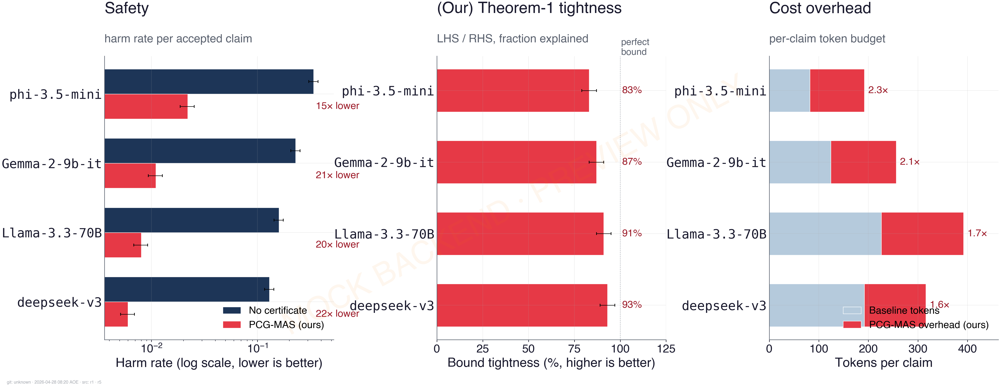
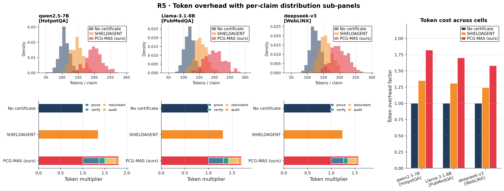

# PCG-MAS: Proof-Carrying Verification for LLM Multi-Agents

> Companion artifact for the current NeurIPS-style manuscript on proof-carrying verification for LLM multi-agent systems.
> An agentic answer is accepted only when it carries a replayable certificate tying the emitted claim to committed evidence, execution metadata, policy constraints, and calibrated risk.

## Repository Overview

**PCG-MAS** turns an LLM-agent run into an auditable runtime event. Retrieved evidence, tool or function or MCP calls, schema checks, memory reads and writes, policy gates, delegation steps, and emitted claims or actions are logged into a typed runtime graph and verified through a unified certificate.

The benchmark compares three operating modes:

1. **No certificate** — ordinary agentic generation without proof-carrying verification.
2. **SHIELDAGENT** — a safety-policy guardrail baseline based on verifiable policy reasoning over agent trajectories.
3. **PCG-MAS (ours)** — unified certificates, committed evidence, replayable pipelines, independent support paths, mask-and-replay diagnosis, and risk-aware control.

The five paper-facing result families are:

    R1 — finite-sample audit decomposition
    R2 — dependency-aware redundancy under adversarial stress
    R3 — replay-interventional responsibility and diagnosis
    R4 — risk-control frontier
    R5 — certification overhead

The benchmark is organized as a 7 x 8 model-dataset matrix: 40 local cells and 16 remote or Colab cells.

## Quick Start

Create an environment:

    python3.12 -m venv multi-agents
    source multi-agents/bin/activate
    pip install -r requirements.txt

Regenerate the fast paper-facing artifacts:

    PYTHONPATH=src python scripts/v4_make_proxy_metrics.py
    PYTHONPATH=src python src/pcg/eval/intro_hero_v4.py --metrics results/v4/proxy_metrics.json --out figures/intro_hero_v4
    PYTHONPATH=src python scripts/v4_make_r1_r5_figures.py
    PYTHONPATH=src python scripts/v4_make_latex_tables.py
    PYTHONPATH=src python scripts/v4_collect_artifacts.py

Dry-run one local experiment cell before any expensive run:

    PYTHONPATH=src python scripts/v4_run_matrix_local.py --dry-run --n-examples 3 --seeds 0 --datasets hotpotqa --models phi-3.5-mini --experiments r1

The full local matrix runner requires `--allow-full-run` to prevent accidental long jobs.

## What PCG-MAS Verifies

At time `t`, the runtime maintains a typed graph:

    G_t = (V_t, E_t, tau_V, tau_E, attr_t)

where nodes and edges represent evidence, tools, schemas, memory, policy gates, delegation, claims, and actions.

A claim is accepted only when it carries a certificate:

    Z = (c, S, Pi, Gamma, p, meta)

where:

- `c` is the candidate claim or action-level statement.
- `S` is the support set of evidence and runtime components.
- `Pi` is the replayable pipeline used to reconstruct support.
- `Gamma` is the execution and policy contract.
- `p` is the originating prompt or task context.
- `meta` stores hashes, timestamps, model or tool versions, parameters, schemas, and replay settings.

The checker verifies integrity, replay, entailment or deterministic checking, and semantic coverage. This makes accepted outputs externally auditable without requiring model-internal access.

## Theoretical Quantity Map

| File | Quantity or symbol | Short description |
|:---|:---|:---|
| `src/pcg/graph.py` | `G_t` | Typed runtime graph for evidence, tools, schemas, memory, policy, delegation, claims, and actions. |
| `src/pcg/certificate.py` | `Z=(c,S,Pi,Gamma,p,meta)` | Unified proof-carrying certificate and canonical serialization. |
| `src/pcg/commitments.py` | `H(.)` | Hash commitments and audit-log utilities for evidence and runtime objects. |
| `src/pcg/checker.py` | `Check(Z;G_t)` | Unified verification predicate for integrity, replay, checking or entailment, and coverage. |
| `src/pcg/independence.py` | `(delta,kappa)` separation and `rho` | Support-path separation and residual dependence control. |
| `src/pcg/responsibility.py` | `Resp` | Mask-and-replay responsibility estimation over runtime components. |
| `src/pcg/risk.py` | `r(b,Z)` and control action | Risk-aware controller over `Answer`, `Verify`, `Escalate`, and `Refuse`. |
| `src/pcg/privacy.py` | privacy and noise budgets | Aggregate feature release utilities for privacy-sensitive audit settings. |
| `src/pcg/backends/hf_local.py` | local LLM backend | Local Hugging Face and Transformers inference backend. |
| `src/pcg/backends/hf_inference.py` | remote LLM backend | Hosted or HF inference backend for large or gated models. |
| `scripts/v4_make_proxy_metrics.py` | metric schema | Fast deterministic metric manifest for figure and table smoke testing. |
| `scripts/v4_make_r1_r5_figures.py` | R1 to R5 plots | Main paper and appendix figure generation. |
| `scripts/v4_make_latex_tables.py` | table generation | Main-text and appendix LaTeX tables. |
| `scripts/v4_run_matrix_local.py` | 40-cell local runner | Local model-dataset matrix execution. |
| `scripts/v4_run_matrix_remote.py` | 16-cell remote runner | Remote or Colab matrix execution for large backends. |
| `scripts/v4_reconcile_remote_results.py` | local and remote merge | Reconciles local and remote result folders. |
| `scripts/v4_collect_artifacts.py` | artifact manifest | Collects generated figures, tables, metrics, and manifests. |

## Featured Plots

### PCG-MAS v4 overview

### R5 overhead summary

## Generated Paper Artifacts

Expected figure outputs:

    figures/intro_hero_v4.png
    figures/v4/r1_audit_decomposition_v4.pdf
    figures/v4/r2_redundancy_surface_v4.pdf
    figures/v4/r3_responsibility_v4.pdf
    figures/v4/r4_control_frontier_v4.pdf
    figures/v4/r5_overhead_v4.pdf

## File Structure Distribution

_Generated on: **2026-05-02 05:42:10**_  
_Git SHA: `unknown`

| Top-level path | File count |
|:---|---:|
| `src` | 55 |
| `scripts` | 31 |
| `app` | 18 |
| `configs` | 13 |
| `figures` | 13 |
| `docs` | 10 |
| `tests` | 9 |
| `.` | 7 |
| `.github` | 2 |
| `latex` | 2 |
| `notebooks` | 2 |
| `artifacts` | 1 |

## File Type Distribution

| Extension | Count | Percentage |
|:---|---:|---:|
| `.py` | 99 | 60.7% |
| `(no ext)` | 16 | 9.8% |
| `.yaml` | 12 | 7.4% |
| `.tex` | 9 | 5.5% |
| `.pdf` | 6 | 3.7% |
| `.png` | 6 | 3.7% |
| `.json` | 3 | 1.8% |
| `.ipynb` | 2 | 1.2% |
| `.md` | 2 | 1.2% |
| `.sh` | 2 | 1.2% |
| `.txt` | 2 | 1.2% |
| `.yml` | 2 | 1.2% |
| `.bak_step6` | 1 | 0.6% |
| `.toml` | 1 | 0.6% |

**Total tracked-style files counted:** **163**

## Submission Snapshot

This repository snapshot supports the current PCG-MAS manuscript and artifact pipeline. Reviewers or collaborators should use the generated figures, tables, metric manifest, and local or remote runner scripts rather than older Makefile-era artifacts.

Suggested smoke validation:

    python -m compileall src scripts
    python scripts/v4_run_matrix_local.py --allow-full-run --n-examples 200 --seeds 0 1 2 3 4 --experiments r1 r2 r3 r4 r5

For local execution, start with a one-cell dry run. For large backends, use:

    notebooks/pcg_v4_colab_16cells.ipynb

`HF_TOKEN` is required only for gated or authenticated model access, especially Meta Llama checkpoints and any HF Inference or router calls needed for the remote split.

## Notes

- Full local outputs should write to `results/v4_matrix/local/`.
- Full remote outputs should write to `results/v4_matrix/remote/`.
