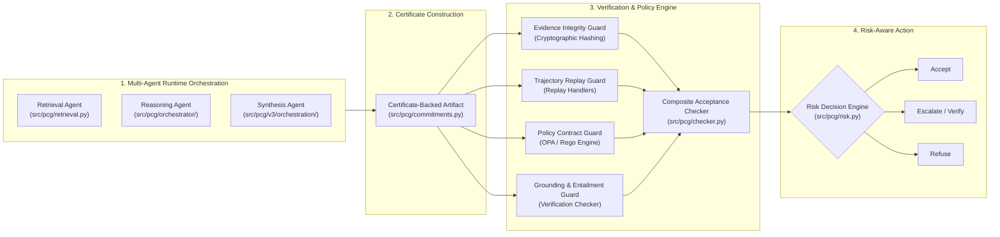

# PCG-MAS: Proof-Carrying Generation for Multi-Agent Systems

[](LICENSE)
[](pyproject.toml)
[](#research-status--scope)
[](pyproject.toml)
[](https://x.com/SupratikSarkar_)

> **Certificate-backed execution verification and risk-aware control for multi-agent LLM systems via evidence integrity verification, replay validation, and execution-policy checks.**

---

## Overview

Complex multi-agent LLM workflows routinely distribute reasoning, tool retrieval, and sub-task synthesis across multiple autonomous agents. However, conventional multi-agent architectures lack verifiable execution guarantees, leaving downstream systems vulnerable to ungrounded reasoning, intermediate state corruption, and cascading failures.

**PCG-MAS** introduces a certificate-backed execution architecture for multi-agent systems. In this framework, an agent's claim or synthesized artifact is accepted by downstream consumers or orchestrators **only when accompanied by a verifiable certificate package**:

* **Evidence Integrity Verification**: Cryptographic hashing and retrieval commitment validation binding claims to source context.
* **Replay Validation**: Deterministic or bounded-variance execution trajectory reproducibility.
* **Execution-Policy Checks**: Conformance to typed verification contracts, domain invariants, and Open Policy Agent (OPA/Rego) policies.
* **Grounding & Entailment Verification**: Structural derivation and factual consistency checks against verified source evidence.

The certificate evaluation enables fine-grained audit decomposition, agent responsibility attribution, and risk-calibrated execution control (`accept`, `verify`, `escalate`, `refuse`).

```
+-------------------------------------------------------------------------------------------------+
|                                    PCG-MAS VERIFICATION FLOW                                    |
|                                                                                                 |
|   [ Multi-Agent Runtime ]        [ Certificate Packaging ]         [ Modular Verification ]     |
|   • Agent A (Retrieval)          • Claim & Context Hashing          • Evidence Integrity Check  |
|   • Agent B (Reasoning)    --->  • Execution Trace Recording  --->  • Trajectory Replay Guard   |
|   • Agent C (Synthesis)          • Policy Contract Metadata         • Policy Contract Evaluator |
|                                  • Verification Tokens              • Grounding & Entailment    |
|                                                                     • Decision: Accept / Refuse |
+-------------------------------------------------------------------------------------------------+
```


```mermaid
flowchart LR
    subgraph Agents["1. Multi-Agent Runtime Orchestration"]
        AG1["Retrieval Agent\n(src/pcg/retrieval.py)"]
        AG2["Reasoning Agent\n(src/pcg/orchestrator/)"]
        AG3["Synthesis Agent\n(src/pcg/v3/orchestration/)"]
    end

    subgraph Cert["2. Certificate Construction"]
        Z["Certificate-Backed Artifact\n(src/pcg/commitments.py)"]
    end

    subgraph Verification["3. Verification & Policy Engine"]
        VH["Evidence Integrity Guard\n(Cryptographic Hashing)"]
        VPI["Trajectory Replay Guard\n(Replay Handlers)"]
        VG["Policy Contract Guard\n(OPA / Rego Engine)"]
        VENT["Grounding & Entailment Guard\n(Verification Checker)"]
        PRED["Composite Acceptance Checker\n(src/pcg/checker.py)"]
    end

    subgraph Control["4. Risk-Aware Action"]
        DEC{"Risk Decision Engine\n(src/pcg/risk.py)"}
        ACT["Accept"]
        ESC["Escalate / Verify"]
        REF["Refuse"]
    end

    Agents --> Z
    Z --> VH & VPI & VG & VENT --> PRED
    PRED --> DEC
    DEC --> ACT
    DEC --> ESC
    DEC --> REF
```

---

## Research Status & Scope

* **Classification**: `ONGOING RESEARCH` (Collaborative research implementation).
* **Collaboration Context**: Collaborative research exploration associated with Indian Statistical Institute (ISI) Kolkata.
* **Status**: Ongoing active research prototype and software framework (`pcg-mas v0.1.0`).
* **Double-Blind Review Notice**: To preserve the integrity of ongoing peer review, this repository exposes open engineering architecture, modular verification abstractions, and local test harnesses. Anonymous manuscript drafts, confidential submission identifiers, and private review artifacts are strictly excluded.

---

## Architecture & Subsystems

| Subsystem | Module | Description |
| :--- | :--- | :--- |
| **Certificate Checker** | `src/pcg/checker.py` | Composite verification engine evaluating evidence, replay consistency, and contract compliance. |
| **Evidence Commitments**| `src/pcg/commitments.py` | Cryptographic evidence hashing and immutable state commitment structures. |
| **Multi-Agent Replay** | `src/pcg/orchestrator/` | Trajectory serialization, LangGraph state flows, and deterministic replay harnesses. |
| **Risk-Aware Router** | `src/pcg/risk.py` | Threshold-based triage: routing verified claims between `accept`, `verify`, `escalate`, and `refuse`. |
| **Policy Engine (OPA)** | `src/pcg/v3/policy/` | Open Policy Agent (OPA) / Rego contract evaluation and local boundary enforcement. |
| **Credit Attribution** | `src/pcg/responsibility.py`| Mask-and-replay attribution for evaluating individual agent responsibility during execution failures. |
| **Telemetry & Tracing** | `src/pcg/v3/telemetry/` | Native OpenTelemetry and LangSmith tracing integrations for distributed execution. |

---

## Quick Start & Verification

### 1. Installation
Requires Python 3.10–3.12 (macOS, Linux, or WSL2):
```bash
# Clone the repository
git clone https://github.com/supratik-sarkar/proof-carrying-multi-agents.git
cd proof-carrying-multi-agents

# Create virtual environment
python3 -m venv .venv
source .venv/bin/activate

# Install package in editable development mode
pip install -e .
```

### 2. Basic Certificate Verification Example
```python
from pcg.checker import verify_certificate
from pcg.commitments import create_evidence_commitment

# Build evidence commitment
evidence = "Patient exhibits elevated troponin levels consistent with acute myocardial infarction."
commitment = create_evidence_commitment(evidence)

# Evaluate acceptance certificate
result = verify_certificate(
    claim="Acute myocardial infarction indicated.",
    commitment=commitment,
    context={"domain": "clinical_triage"}
)
print("Acceptance decision:", result.accepted)
```

### 3. Running Unit Tests
```bash
pytest tests/ -q
```

---

## Repository Structure

```text
proof-carrying-multi-agents/
├── configs/            # Experiment configurations and orchestrator topologies
├── docs/               # Technical specifications and design runbooks
├── schemas/            # JSON Schema definitions for certificates and commitments
├── src/
│   └── pcg/
│       ├── checker.py          # Composite verification checker
│       ├── commitments.py      # Evidence hashing and cryptographic state trees
│       ├── responsibility.py   # Mask-and-replay agent credit attribution
│       ├── retrieval.py        # Grounded retrieval and passage validation
│       ├── risk.py             # Risk-calibrated decision engine
│       ├── orchestrator/       # LangGraph multi-agent flow handlers
│       └── v3/
│           ├── orchestration/  # Graph state transitions and execution nodes
│           ├── policy/         # OPA/Rego contracts and local evaluation rules
│           └── telemetry/      # OpenTelemetry and LangSmith collectors
├── tests/              # Comprehensive unit and integration test suite
├── pyproject.toml      # Build metadata (name: pcg-mas v0.1.0)
└── LICENSE             # MIT License
```

---

## Portfolio Navigation

Part of the **Research Systems Portfolio** by [Supratik Sarkar](https://github.com/supratik-sarkar):
* [proof-carrying-multi-agents](https://github.com/supratik-sarkar/proof-carrying-multi-agents) — Proof-carrying generation and verification in multi-agent systems.
* [quantifying-hallucinations](https://github.com/supratik-sarkar/quantifying-hallucinations) — Spectral hypergraph diffusion for multimodal hallucination bounding.
* [transmission-vs-reconstruction](https://github.com/supratik-sarkar/transmission-vs-reconstruction) — Channel-theoretic analysis of generative representation models.
* [safe-discharge-summary](https://github.com/supratik-sarkar/safe-discharge-summary) — Grounding and clinical safety audit frameworks.
