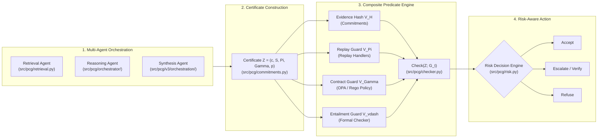

# PCG-MAS: Proof-Carrying Generation for Multi-Agent Systems

[](LICENSE)
[](pyproject.toml)
[](#research-status--scope)
[](pyproject.toml)
[](https://x.com/SupratikSarkar_)

> **Certificate-carrying verification and risk-aware control for multi-agent LLM systems via cryptographic evidence commitments, replay consistency, and execution contract checking.**

---

## Overview

Complex multi-agent LLM workflows routinely distribute reasoning, tool retrieval, and sub-task synthesis across multiple autonomous agents. However, conventional multi-agent architectures lack verifiable execution guarantees, leaving downstream systems vulnerable to ungrounded reasoning, intermediate state corruption, and cascading failures.

**PCG-MAS** introduces a formal proof-carrying generation architecture for multi-agent systems. In this framework, an agent's claim or synthesized artifact is accepted by downstream consumers or orchestrators **only if it carries a checkable verification certificate**:

$$\mathcal{Z} = \big(c, \mathcal{S}, \Pi, \Gamma, p, \text{meta}\big)$$

The certificate is evaluated against a 4-component composite acceptance predicate:

$$\text{Check}(\mathcal{Z}; G_t) = V_H \cdot V_\Pi \cdot V_\Gamma \cdot V_\vdash$$

* $V_H$: **Evidence Commitment Integrity** (cryptographic hash and retrieval commitment validation).
* $V_\Pi$: **Replay Consistency** (deterministic or bounded-variance trajectory reproducibility).
* $V_\Gamma$: **Execution Contract Compliance** (satisfaction of typed preconditions and OPA/Rego policies).
* $V_\vdash$: **Logical Entailment** (formal or surrogate derivation from verified ground evidence).

```
+-------------------------------------------------------------------------------------------------+
|                                    PCG-MAS VERIFICATION FLOW                                    |
|                                                                                                 |
|   [ Multi-Agent Runtime ]        [ Certificate Packaging ]         [ Predicate Checker ]       |
|   • Agent A (Retrieval)          • Claim & Evidence Hash            • Hash Commitment (V_H)     |
|   • Agent B (Reasoning)    --->  • Execution Trace (Pi)       --->  • Replay Consistency (V_Pi) |
|   • Agent C (Synthesis)          • Policy Contract (Gamma)          • Contract Check (V_Gamma)  |
|                                  • Formal Proof Object (p)          • Entailment Check (V_ent)  |
|                                                                     • Decision: Accept/Refuse   |
+-------------------------------------------------------------------------------------------------+
```


```mermaid
flowchart LR
    subgraph Agents["1. Multi-Agent Orchestration"]
        AG1["Retrieval Agent\n(src/pcg/retrieval.py)"]
        AG2["Reasoning Agent\n(src/pcg/orchestrator/)"]
        AG3["Synthesis Agent\n(src/pcg/v3/orchestration/)"]
    end

    subgraph Cert["2. Certificate Construction"]
        Z["Certificate Z = (c, S, Pi, Gamma, p)\n(src/pcg/commitments.py)"]
    end

    subgraph Verification["3. Composite Predicate Engine"]
        VH["Evidence Hash V_H\n(Commitments)"]
        VPI["Replay Guard V_Pi\n(Replay Handlers)"]
        VG["Contract Guard V_Gamma\n(OPA / Rego Policy)"]
        VENT["Entailment Guard V_vdash\n(Formal Checker)"]
        PRED["Check(Z; G_t)\n(src/pcg/checker.py)"]
    end

    subgraph Control["4. Risk-Aware Action"]
        DEC{"Risk Decision Engine\n(src/pcg/risk.py)"}
        ACT["Accept"]
        ESC["Escalate / Verify"]
        REF["Refuse"]
    end

    Agents --> Z
    Z --> VH & VPI & VG & VENT --> PRED
    PRED --> DEC
    DEC --> ACT
    DEC --> ESC
    DEC --> REF
```

---

## Research Status & Scope

* **Classification**: `ONGOING RESEARCH` (Collaborative research implementation).
* **Collaboration Context**: Collaborative research exploration associated with Indian Statistical Institute (ISI) Kolkata.
* **Status**: Ongoing active research prototype and software framework.
* **Double-Blind Review Notice**: To preserve the integrity of ongoing peer review, this repository exposes only open engineering architecture, modular verification abstractions, and local test harnesses. Anonymous manuscript drafts, confidential conference submission identifiers, and private review artifacts are strictly excluded.

---

## Architecture & Subsystems

| Subsystem | Module | Description |
| :--- | :--- | :--- |
| **Certificate Checker** | `src/pcg/checker.py` | Implements the four-way composite acceptance predicate $\text{Check}(\mathcal{Z}; G_t)$. |
| **Evidence Commitments**| `src/pcg/commitments.py` | Cryptographic evidence hashing and immutable state commitment structures. |
| **Multi-Agent Replay** | `src/pcg/orchestrator/` | Trajectory serialization, LangGraph state flows, and deterministic replay harnesses. |
| **Risk-Aware Router** | `src/pcg/risk.py` | Threshold-based triage: routing verified claims between `accept`, `verify`, `escalate`, and `refuse`. |
| **Policy Engine (OPA)** | `src/pcg/v3/policy/` | Open Policy Agent (OPA) / Rego contract evaluation and local boundary enforcement. |
| **Credit Attribution** | `src/pcg/responsibility.py`| Mask-and-replay Shapley value attribution for agent responsibility during failure. |
| **Telemetry & Tracing** | `src/pcg/v3/telemetry/` | Native OpenTelemetry and LangSmith tracing integrations for distributed execution. |

---

## Quick Start & Verification

### 1. Installation
Requires Python 3.10–3.12 (macOS, Linux, or WSL2):
```bash
# Clone the repository
git clone https://github.com/supratik-sarkar/proof-carrying-multi-agents.git
cd proof-carrying-multi-agents

# Create virtual environment
python3 -m venv .venv
source .venv/bin/activate

# Install package in editable development mode
pip install -e .
```

### 2. Basic Certificate Verification Example
```python
from pcg.checker import verify_certificate
from pcg.commitments import create_evidence_commitment

# Build evidence commitment
evidence = "Patient exhibits elevated troponin levels consistent with acute myocardial infarction."
commitment = create_evidence_commitment(evidence)

# Evaluate acceptance certificate
result = verify_certificate(
    claim="Acute myocardial infarction indicated.",
    commitment=commitment,
    context={"domain": "clinical_triage"}
)
print("Acceptance decision:", result.accepted)
```

### 3. Running Unit Tests
```bash
pytest tests/ -q
```

---

## Repository Structure

```text
proof-carrying-multi-agents/
├── configs/            # Experiment configurations and orchestrator topologies
├── docs/               # Technical specifications and design runbooks
├── schemas/            # JSON Schema definitions for certificates and commitments
├── src/
│   └── pcg/
│       ├── checker.py          # Primary composite verification predicate Check(Z; G_t)
│       ├── commitments.py      # Evidence hashing and cryptographic state trees
│       ├── responsibility.py   # Mask-and-replay agent credit attribution
│       ├── retrieval.py        # Grounded retrieval and passage validation
│       ├── risk.py             # Risk-calibrated decision engine
│       ├── orchestrator/       # LangGraph multi-agent flow handlers
│       └── v3/
│           ├── orchestration/  # Graph state transitions and execution nodes
│           ├── policy/         # OPA/Rego contracts and local evaluation rules
│           └── telemetry/      # OpenTelemetry and LangSmith collectors
├── tests/              # Comprehensive unit and integration test suite
├── pyproject.toml      # Build metadata (name: pcg-mas v0.1.0)
└── LICENSE             # MIT License
```

---

## Portfolio Navigation

Part of the **Research Systems Portfolio** by [Supratik Sarkar](https://github.com/supratik-sarkar):
* [proof-carrying-multi-agents](https://github.com/supratik-sarkar/proof-carrying-multi-agents) — Proof-carrying generation and verification in multi-agent systems.
* [quantifying-hallucinations](https://github.com/supratik-sarkar/quantifying-hallucinations) — Spectral hypergraph diffusion for multimodal hallucination bounding.
* [transmission-vs-reconstruction](https://github.com/supratik-sarkar/transmission-vs-reconstruction) — Channel-theoretic analysis of generative representation models.
* [safe-discharge-summary](https://github.com/supratik-sarkar/safe-discharge-summary) — Grounding and clinical safety audit frameworks.
