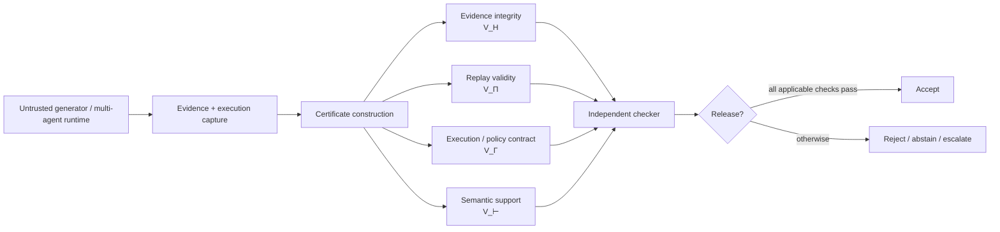

# PCG-MAS v3.7

<p align="center">
  <strong>Proof-Carrying Generation for Multi-Agent Systems</strong><br>
  Consumer-verifiable release assurance for LLM workflows through replayable acceptance certificates.
</p>

<p align="center">
  
  
  
  
</p>

> **PCG-MAS treats the generator as untrusted. A result is releasable only when it is accompanied by an acceptance certificate that an independent consumer can check against declared evidence, replay, execution, and semantic-support contracts.**

The local interactive demonstration code lives under [`app/`](app/) and can be run locally with zero external network dependencies. The sealed experimental record in [`reproducibility/v3_7/`](reproducibility/v3_7/) is the reproducibility authority.

---

## Why PCG-MAS?

Multi-agent LLM systems can distribute retrieval, reasoning, tool use, policy decisions, and synthesis across several components. That flexibility also creates a verification problem: a downstream consumer may receive a plausible output without a compact, independently checkable account of **what evidence supported it, what execution path produced it, what policy applied, and whether the declared acceptance conditions actually passed**.

PCG-MAS changes the release contract.

Instead of asking a consumer to trust a model, provider, agent graph, or orchestration trace, the producer emits a **proof-carrying artifact**:

$$
Z = (\text{claim}, \text{evidence}, \text{execution record}, \text{certificate})
$$

and acceptance is determined by a checker:

$$
\mathrm{Check}(Z;G_t) = V_H \cdot V_{\Pi} \cdot V_{\Gamma} \cdot V_{\vdash}
$$

where the applicable channels represent:

| Check | Role |
|---|---|
| $V_H$ | evidence / commitment integrity |
| $V_{\Pi}$ | replay and execution-consistency validation |
| $V_{\Gamma}$ | declared execution / policy-contract validation |
| $V_{\vdash}$ | semantic support / entailment validation |

A releasable result must satisfy the checks declared applicable by the contract. The guarantee is therefore **checker-relative and contract-relative**: PCG-MAS does not claim that a passing certificate establishes unrestricted world truth.

### What is different here?

PCG-MAS is designed around five separations that are easy to blur in ordinary agent systems:

1. **Generation is not acceptance.** A model may propose an output; an independent checker decides whether the output satisfies the release contract.
2. **Evidence is committed, not merely cited.** Evidence identity, hashes, provenance, and lineage can be checked independently of the generator.
3. **Execution is replay-aware.** The certificate can bind the claim to an execution trajectory, policy state, tool interactions, and recorded commitments.
4. **Verification is decomposable.** A failure can be localized to evidence, replay, policy/execution, or semantic-support channels rather than collapsed into a single opaque score.
5. **The release record is auditable.** Reproducibility artifacts, manifests, checksums, change-control records, and deterministic replay scripts are part of the release surface.

---

## Architecture


```mermaid
flowchart LR
    A["Untrusted generator / multi-agent runtime"]
    B["Evidence + execution capture"]
    C["Certificate construction"]
    H["Evidence integrity\nV_H"]
    P["Replay validity\nV_Π"]
    G["Execution / policy contract\nV_Γ"]
    E["Semantic support\nV_⊢"]
    K["Independent checker"]
    R{"Release?"}
    Y["Accept"]
    N["Reject / abstain / escalate"]

    A --> B --> C
    C --> H
    C --> P
    C --> G
    C --> E
    H --> K
    P --> K
    G --> K
    E --> K
    K --> R
    R -->|all applicable checks pass| Y
    R -->|otherwise| N
```

The implementation is intentionally modular. The current source tree includes certificate construction and checking, evidence commitments, provenance and lineage, replay handlers, policy interfaces including local and OPA-backed evaluation, provider contracts, telemetry, responsibility analysis, risk controls, artifact emission, and test harnesses.

---

## v3.7 at a glance

| Release property | v3.7 record |
|---|---:|
| Structural evaluation matrix | **56 model × dataset cells** |
| Generation observations preserved | **2,240** |
| Raw responses preserved | **2,240** |
| Raw agent trajectories preserved | **434** |
| Execution receipts preserved | **140** |
| Admitted historical donor artifacts | **3,139** |
| Deterministic aggregate derivations | **10 / 10 PASS** |
| Stored artifact replay | **24 figure pairs + 34 tables PASS** |
| Checksummed record files | **3,448** |
| External private-tree dependency | **None** |

The release record also preserves explicit donor-to-public-projection bindings for sanitized historical execution evidence. Public projections retain their own SHA-256 identity while remaining linked to the historical donor SHA-256.

---

## Quick start

### 1. Clone

Use the clone URL shown by the repository host:

```bash
git clone <REPOSITORY_URL>
cd proof-carrying-multi-agents
```

The README intentionally does not hard-code a host-specific clone URL so that the same release tree can be mirrored without changing documentation.

### 2. Create an environment

Use Python >= 3.12.13 as declared in [`pyproject.toml`](pyproject.toml).

```bash
python3 -m venv .venv
source .venv/bin/activate

python -m pip install --upgrade pip
python -m pip install -e .
```

For a dependency-expanded environment, the repository also provides [`requirements.txt`](requirements.txt). A root [`uv.lock`](uv.lock) may be used by `uv` users when present in the release branch.

### 3. Run the test suite

```bash
python -m pytest -q
```

### 4. Inspect the checker

The principal implementation surfaces are:

```text
src/pcg/certificate.py
src/pcg/checker.py
src/pcg/commitments.py
src/pcg/provenance/
src/pcg/orchestrator/
src/pcg/v3/
```

API examples should be taken from the tests and current source rather than copied from older releases; this keeps examples synchronized with the checked implementation.

---

# Reproduce the sealed v3.7 record

The scientific/reproducibility authority is:

```text
reproducibility/v3_7/
```

It is intentionally self-contained for integrity checks and deterministic recomputation of the retained numerical/artifact record.

## Minimal replay environment

From the repository root:

```bash
python3 -m venv .venv-repro
source .venv-repro/bin/activate

python -m pip install --upgrade pip
python -m pip install -r reproducibility/v3_7/16_replay/requirements.txt

export PYTHON="$(pwd)/.venv-repro/bin/python"
```

For PDF/figure replay, a TeX engine and `pdftoppm` may also be required. See [`reproducibility/v3_7/16_replay/REPLAY.md`](reproducibility/v3_7/16_replay/REPLAY.md) for the authoritative replay instructions.

## A. Verify record integrity

```bash
sh reproducibility/v3_7/16_replay/verify_hashes.sh
```

## B. Recompute deterministic aggregate metrics

```bash
sh reproducibility/v3_7/16_replay/rebuild_metrics.sh
```

The sealed v3.7 acceptance run reproduces **10/10 deterministic aggregate derivations** within the declared numerical tolerances.

## C. Rebuild stored artifacts

```bash
sh reproducibility/v3_7/16_replay/rebuild_artifacts.sh
```

The accepted release replay matches **24 stored figure pairs and 34 generated tables**.

---

## Reproducibility record anatomy

```text
reproducibility/v3_7/
├── 00_release/          # release identity, scope, completeness, final acceptance
├── 01_protocol/         # experiment matrix, model/dataset/method registries
├── 02_configs/          # current and historically bound configuration records
├── 03_prompts/          # retained prompt material and prompt/input bindings
├── 04_inputs/           # dataset/source identities, input hashes, split manifests
├── 05_generations/      # generation manifests and preserved raw responses
├── 06_agent_traces/     # trajectory, action, tool-call, and tool-output evidence
├── 07_verification/     # verifier identities/invocations and retention-status records
├── 08_certificates/     # certificate identities, obligations, decisions/status records
├── 09_outcomes/         # outcome-authority and retention-status records
├── 10_execution/        # run registry, timeline, receipts, execution provenance
├── 11_environment/      # environment, dependency, hardware, and freeze information
├── 12_code_provenance/  # source manifests, hashes, lineage, repository bindings
├── 13_metrics/          # metric registry, aggregate lineage, recomputation receipts
├── 14_artifacts/        # figure/table lineage, inventories, replay receipts
├── 15_change_control/   # donor bindings, numerical authority, corrections, locks
├── 16_replay/           # integrity, metric, artifact, and seal/replay utilities
├── RECORD_MANIFEST.json
├── RECORD_SEAL.json
└── SHA256SUMS.txt
```

---

## Evidence-retention boundary

The v3.7 record is explicit about what is and is not historically recoverable.

| Evidence class | v3.7 state |
|---|---|
| Prompt / input / configuration provenance | **Retained** |
| Generation identities and raw responses | **Retained** |
| Agent trajectories and tool evidence | **Retained** |
| Execution receipts and run provenance | **Retained** |
| Current v3.7 per-observation verifier **values** | **NOT_RETAINED** |
| Current v3.7 per-observation certificate-factor **values** | **NOT_RETAINED** |
| Current v3.7 per-observation acceptance-decision **values** | **NOT_RETAINED** |
| Current v3.7 per-observation outcome-label **values** | **NOT_RETAINED** |
| Current v3.7 aggregate numerical authority | **Retained** |
| Deterministic aggregate replay | **Retained / PASS** |
| Figure/table replay | **Retained / PASS** |

Sections `07_verification/`, `08_certificates/`, and `09_outcomes/` enumerate the affected identities and retention state. Missing scientific values were **not reconstructed from aggregates, copied from an older release, or fabricated retrospectively**.

This distinction matters:

- the record supports verification of preserved generation/execution evidence;
- the retained v3.7 aggregate numerical record is deterministically replayable;
- the record does **not** claim that every current aggregate can be reconstructed from preserved current per-observation verifier/certificate/outcome values.

The limitation is part of the release contract, not hidden missingness.

---

## Source layout

The public release is a curated projection of the engineering workspace, not a dump of a development machine.

```text
proof-carrying-multi-agents/
├── app/                     # interactive demo and deployment surfaces
├── baselines/               # public baseline adapters/configuration
├── configs/                 # public experiment and runtime configuration
├── docs/                    # public architecture and reproducibility documentation
├── reproducibility/
│   └── v3_7/                # sealed v3.7 reproducibility record
├── schemas/                 # machine-readable record schemas
├── scripts/                 # public analysis/replay/build utilities
├── src/
│   └── pcg/                 # PCG-MAS implementation
├── tests/                   # unit, integration, and contract tests
├── Makefile
├── pyproject.toml
├── requirements.txt
├── uv.lock
└── README.md
```

Local environments, caches, model downloads, private working directories, publication-source trees, credentials, operator notes, and internal handoff/audit material are intentionally outside the public release surface.

---

## Core implementation map

| Area | Representative source |
|---|---|
| Certificate object and construction | `src/pcg/certificate.py` |
| Composite acceptance checking | `src/pcg/checker.py` |
| Evidence commitments | `src/pcg/commitments.py` |
| Multi-agent execution/replay | `src/pcg/orchestrator/`, `src/pcg/v3/orchestration/` |
| Content-addressed evidence / replay storage | `src/pcg/v3/cas/` |
| Execution instrumentation | `src/pcg/v3/exec/` |
| Policy evaluation | `src/pcg/v3/policy/` |
| Provider contracts and conformance | `src/pcg/v3/providers/` |
| Provenance and lineage | `src/pcg/provenance/`, `src/pcg/v3/lineage/` |
| Responsibility analysis | `src/pcg/responsibility.py`, `src/pcg/v3/science/responsibility.py` |
| Risk / control logic | `src/pcg/risk.py`, `src/pcg/v3/science/controller.py` |
| Statistics / bootstrap utilities | `src/pcg/eval/`, `src/pcg/v3/stats/` |
| Telemetry | `src/pcg/v3/telemetry/` |
| Artifact emission | `src/pcg/v3/artifacts/` |

---

## Repository composition

<!-- BEGIN AUTO-GENERATED REPOSITORY COMPOSITION -->

Computed from `git ls-files` on the clean `release/v3.7` tracked tree:

| File Type | Category | Count | % of Files | Total Bytes | % of Bytes |
|:---|:---|---:|---:|---:|---:|
| `.json` | JSON structured data & records | 2,920 | 73.7% | 15,060,417 B | 22.5% |
| `.py` | Python source code & tests | 403 | 10.2% | 2,598,441 B | 3.9% |
| `.txt` | Plain text fixtures & manifests | 300 | 7.6% | 1,019,714 B | 1.5% |
| `.csv` | Tabular metrics & summaries | 91 | 2.3% | 6,498,374 B | 9.7% |
| `.tex` | LaTeX table & figure fragments | 47 | 1.2% | 116,811 B | 0.2% |
| `.md` | Markdown documentation | 44 | 1.1% | 253,537 B | 0.4% |
| `.jsonl` | JSON Lines execution streams | 42 | 1.1% | 33,897,215 B | 50.6% |
| Other | Miscellaneous formats (`.yaml`, `.sh`, `.pdf`, `.png`, etc.) | 116 | 2.9% | 7,482,453 B | 11.2% |
| **Total** | **All tracked files** | **3,963** | **100.0%** | **66,926,962 B** | **100.0%** |

<!-- END AUTO-GENERATED REPOSITORY COMPOSITION -->

The release process computes this block only after stale/internal material has been removed, so local environments, dependency caches, model stores, and other non-release files cannot distort the percentages.

---

## Interactive demo

The demo exposes a user-facing view of the certificate lifecycle, including representative evidence, execution, policy, lineage, and certificate-inspection surfaces.

The application code lives under [`app/`](app/). It can be run entirely locally without external network dependencies or telemetry:

```sh
cd app
# Launch local server
python server.py
```

The demo is deliberately separated from experimental scoring. It is useful for understanding the mechanism, but it is **not** a source of reported scientific measurements. Generated dependency directories such as `node_modules/` are not part of the source release.

---

## Design principles

### Fail closed
Missing required evidence or an unsatisfied applicable check should not silently become acceptance.

### Consumer-verifiable
The verifier should be able to check a release object without trusting the producer's narrative about how that object was generated.

### Explicit applicability
Not every checker or comparator is meaningful for every task. Applicability is represented explicitly rather than encoded by silent dropping or synthetic scores.

### Immutable evidence identity
Evidence, execution records, and public projections are identified by content hashes so that changes are detectable.

### Separation of raw and derived state
Raw responses, trajectories, verification state, certificate state, metrics, and presentation artifacts occupy different layers in the reproducibility record.

### No retroactive evidence invention
If a historical scientific value was not retained, the release records that fact. Aggregate values are not reverse-engineered into synthetic per-observation evidence.

### Mirror-safe documentation
Repository documentation avoids author-specific clone URLs, private filesystem paths, local usernames, or identity-bearing working metadata. The same release tree can therefore be hosted at more than one repository endpoint without editing the README.

---

## Testing

```bash
python -m pytest -q
```

For the sealed record, run the three v3.7 replay gates separately:

```bash
sh reproducibility/v3_7/16_replay/verify_hashes.sh
sh reproducibility/v3_7/16_replay/rebuild_metrics.sh
sh reproducibility/v3_7/16_replay/rebuild_artifacts.sh
```

---

## Dependency surfaces

| Surface | Authority |
|---|---|
| Python package metadata | `pyproject.toml` |
| Expanded root environment | `requirements.txt` |
| Locked root environment, when shipped | `uv.lock` |
| v3.7 replay environment | `reproducibility/v3_7/16_replay/requirements.txt` |
| Recorded historical environment | `reproducibility/v3_7/11_environment/` |

Optional integrations—hosted model providers, local model backends, policy engines, tracing systems, or deployment tooling—should not be confused with the minimal dependency set required to inspect and verify the sealed record.

---

## Release integrity

The v3.7 reproducibility record contains:

- `RECORD_MANIFEST.json` — admitted files and release metadata;
- `SHA256SUMS.txt` — file-level integrity identities;
- `RECORD_SEAL.json` — seal binding the record manifest/checksum state;
- `00_release/final_acceptance.json` — release acceptance summary;
- `15_change_control/v3_6_donor_binding.json` — explicit historical donor binding;
- `15_change_control/donor_artifact_binding.jsonl` — per-artifact donor/public-projection reconciliation.

Do not edit files inside the sealed record casually. Any deliberate change to a sealed artifact requires the record to be revalidated and resealed.

---

## Privacy and release hygiene

The public release is intended to contain **only project-relevant public engineering and reproducibility material**.

It must not contain:

- API keys, access tokens, cookies, credentials, or private keys;
- `.env` secret material;
- local filesystem paths or OS usernames;
- private model caches or downloaded checkpoints;
- development-machine environments;
- private working notes, handoff prompts, audit conversations, or operator logs;
- publication-source working directories;
- identity-bearing repository URLs embedded in mirror-safe documentation.

The sealed v3.7 record uses deterministic public projections where historical execution evidence contained private machine-local metadata. Historical donor hashes remain bound to those public projections.

---

## Scope and limitations

PCG-MAS is a research implementation of certificate-carrying acceptance for multi-agent LLM workflows. Its checks are only as meaningful as their declared evidence, policy, replay, and semantic contracts.

A passing certificate should therefore be interpreted as:

> **The released object satisfied the declared checker contract under the retained evidence and execution state.**

It should not be interpreted as an unconditional guarantee of factual truth, safety, legal compliance, or correctness outside that contract.

The v3.7 record also carries the explicit per-observation retention limitation documented above. That limitation should remain visible in downstream use of the artifact.

---

## Where to start

If you want to **understand the idea**:

1. this README;
2. `src/pcg/certificate.py`;
3. `src/pcg/checker.py`;
4. `src/pcg/v3/`;
5. the local demo in `app/`.

If you want to **audit the experiment record**:

1. `reproducibility/v3_7/00_release/`;
2. `reproducibility/v3_7/README.md`;
3. `reproducibility/v3_7/15_change_control/`;
4. `reproducibility/v3_7/16_replay/REPLAY.md`;
5. the three replay commands above.

If you want to **extend the implementation**:

1. `pyproject.toml`;
2. `src/pcg/`;
3. `configs/`;
4. `schemas/`;
5. `tests/`.

---

<p align="center">
  <strong>Generate freely. Release only with evidence that can be checked.</strong>
</p>
