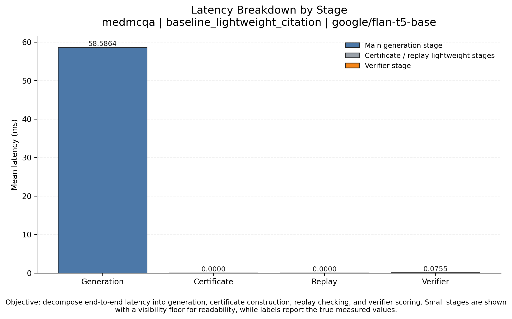
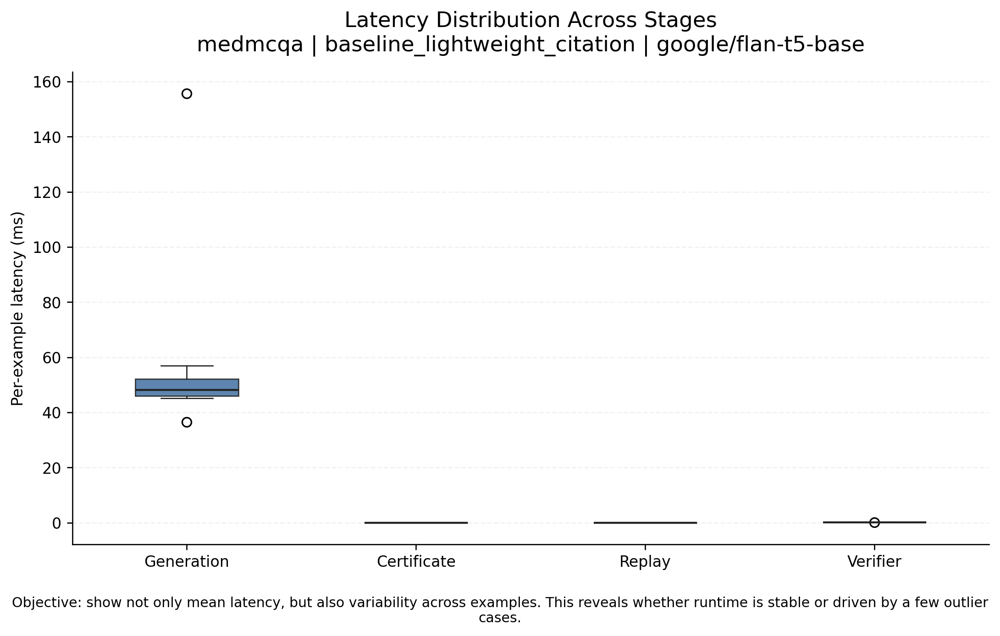
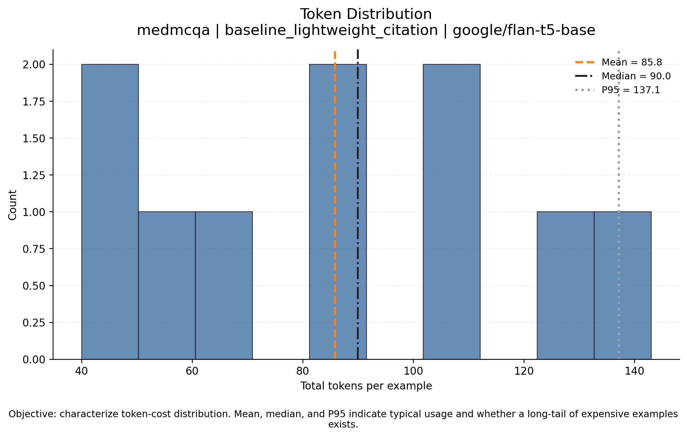
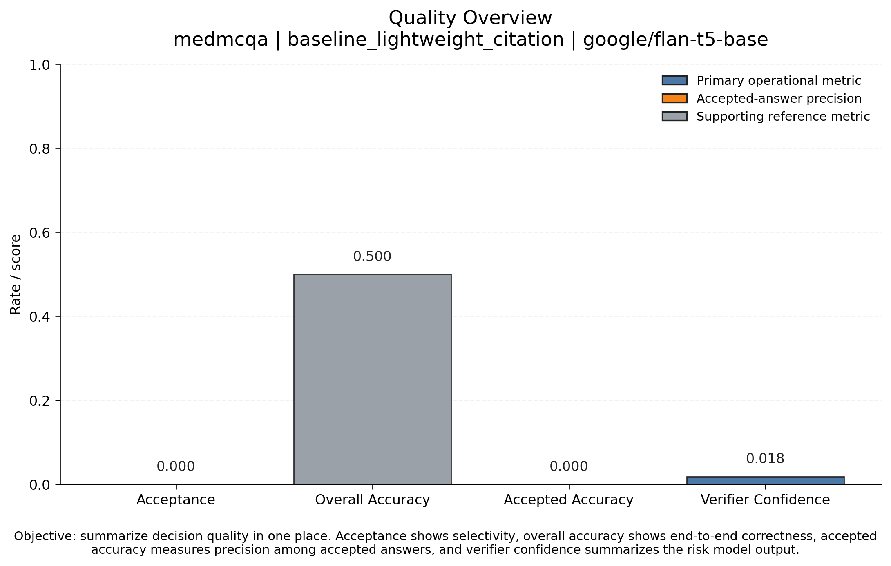

# Proof-Carrying Multi-Agents — READMEv1

This is an interim report page generated before the Colab/GPU stage.

## Included in this snapshot
- runtime telemetry
- certificate construction and replay checks
- healthcare-oriented evaluation adapters
- overhead analysis
- publication-style plots and summary tables

## Latest Result Highlights

### 1. Latency Breakdown


This figure decomposes end-to-end runtime into generation, certificate construction, replay validation, and verifier scoring.

### 2. Latency Distribution Across Stages


This figure shows spread and outliers in latency across examples for each stage.

### 3. Token Distribution


This figure summarizes how token usage is distributed across examples and highlights typical versus tail-heavy cost behavior.

### 4. Quality Overview


This figure summarizes acceptance rate, overall accuracy, accepted-answer accuracy, and verifier confidence in one place.

## Aggregate Overhead Table

| dataset   | mode                          |   acceptance_rate |   answer_accuracy |   accepted_accuracy |   mean_total_tokens |   mean_latency_query_ms |   generation_ms |   certificate_ms |   replay_ms |   verifier_ms |   token_overhead_ratio_vs_posthoc |
|:----------|:------------------------------|------------------:|------------------:|--------------------:|--------------------:|------------------------:|----------------:|-----------------:|------------:|--------------:|----------------------------------:|
| medmcqa   | pcg_full                      |                 0 |              0.55 |                   0 |               82.3  |                 46.887  |         46.7525 |                0 |      0.026  |        0.046  |                            0.9592 |
| medmcqa   | pcg_full                      |                 0 |              0.55 |                   0 |               82.3  |                 46.887  |         46.7525 |                0 |      0.026  |        0.046  |                            0.9592 |
| medmcqa   | baseline_lightweight_citation |                 0 |              0.5  |                   0 |               85.8  |                 70.0163 |         69.9415 |                0 |      0      |        0.0748 |                            1      |
| medmcqa   | baseline_lightweight_citation |                 0 |              0.5  |                   0 |               85.8  |                 70.0163 |         69.9415 |                0 |      0      |        0.0748 |                            1      |
| medmcqa   | pcg_full                      |                 0 |              0.55 |                   0 |               82.3  |                 47.1088 |         46.9731 |                0 |      0.025  |        0.0474 |                            0.9592 |
| medmcqa   | pcg_full                      |                 0 |              0.55 |                   0 |               82.3  |                 47.1088 |         46.9731 |                0 |      0.025  |        0.0474 |                            0.9592 |
| medmcqa   | pcg_full                      |                 0 |              0.55 |                   0 |               82.3  |                 49.9652 |         49.8179 |                0 |      0.0253 |        0.048  |                            0.9592 |
| medmcqa   | pcg_full                      |                 0 |              0.55 |                   0 |               82.3  |                 49.9652 |         49.8179 |                0 |      0.0253 |        0.048  |                            0.9592 |
| medqa     | pcg_full                      |                 0 |              0.1  |                   0 |              227.05 |                 57.3787 |         57.247  |                0 |      0.023  |        0.0456 |                          nan      |
| medmcqa   | baseline_posthoc_verify       |                 0 |              0.5  |                   0 |               85.8  |                 52.2453 |         52.174  |                0 |      0      |        0.0713 |                            1      |
| medmcqa   | baseline_posthoc_verify       |                 0 |              0.5  |                   0 |               85.8  |                 52.2453 |         52.174  |                0 |      0      |        0.0713 |                            1      |
| medmcqa   | baseline_multiagent_no_cert   |                 0 |              0.5  |                   0 |               85.8  |                 57.5812 |         57.5079 |                0 |      0      |        0.0733 |                            1      |
| medmcqa   | baseline_multiagent_no_cert   |                 0 |              0.5  |                   0 |               85.8  |                 57.5812 |         57.5079 |                0 |      0      |        0.0733 |                            1      |
| medmcqa   | baseline_multiagent_no_cert   |                 0 |              0.5  |                   0 |               85.8  |                 51.167  |         51.0981 |                0 |      0      |        0.0689 |                            1      |
| medmcqa   | baseline_multiagent_no_cert   |                 0 |              0.5  |                   0 |               85.8  |                 51.167  |         51.0981 |                0 |      0      |        0.0689 |                            1      |
| medmcqa   | baseline_posthoc_verify       |                 0 |              0.5  |                   0 |               85.8  |                 52.8448 |         52.7739 |                0 |      0      |        0.0709 |                            1      |
| medmcqa   | baseline_posthoc_verify       |                 0 |              0.5  |                   0 |               85.8  |                 52.8448 |         52.7739 |                0 |      0      |        0.0709 |                            1      |
| medmcqa   | baseline_selective            |                 0 |              0.5  |                   0 |               85.8  |                 52.5544 |         52.485  |                0 |      0      |        0.0693 |                            1      |
| medmcqa   | baseline_selective            |                 0 |              0.5  |                   0 |               85.8  |                 52.5544 |         52.485  |                0 |      0      |        0.0693 |                            1      |
| medmcqa   | pcg_full                      |                 0 |              0.5  |                   0 |               85.8  |                 52.8893 |         52.7414 |                0 |      0.0255 |        0.0513 |                            1      |
| medmcqa   | pcg_full                      |                 0 |              0.5  |                   0 |               85.8  |                 52.8893 |         52.7414 |                0 |      0.0255 |        0.0513 |                            1      |
| medmcqa   | pcg_full                      |                 0 |              0.5  |                   0 |               85.8  |                 52.9356 |         52.7896 |                0 |      0.0259 |        0.0504 |                            1      |
| medmcqa   | pcg_full                      |                 0 |              0.5  |                   0 |               85.8  |                 52.9356 |         52.7896 |                0 |      0.0259 |        0.0504 |                            1      |
| medqa     | pcg_full                      |                 0 |              0.1  |                   0 |              227.05 |                 59.3121 |         59.1752 |                0 |      0.0248 |        0.0469 |                          nan      |
| medmcqa   | pcg_full                      |                 0 |              0.55 |                   0 |               82.3  |                 51.2519 |         51.1178 |                0 |      0.0244 |        0.0465 |                            0.9592 |
| medmcqa   | pcg_full                      |                 0 |              0.55 |                   0 |               82.3  |                 51.2519 |         51.1178 |                0 |      0.0244 |        0.0465 |                            0.9592 |
| medmcqa   | baseline_selective            |                 0 |              0.5  |                   0 |               85.8  |                 50.5555 |         50.4858 |                0 |      0      |        0.0697 |                            1      |
| medmcqa   | baseline_selective            |                 0 |              0.5  |                   0 |               85.8  |                 50.5555 |         50.4858 |                0 |      0      |        0.0697 |                            1      |
| medmcqa   | baseline_lightweight_citation |                 0 |              0.5  |                   0 |               85.8  |                 58.6619 |         58.5864 |                0 |      0      |        0.0755 |                            1      |
| medmcqa   | baseline_lightweight_citation |                 0 |              0.5  |                   0 |               85.8  |                 58.6619 |         58.5864 |                0 |      0      |        0.0755 |                            1      |

## Reproducibility

Typical commands:

```bash
PYTHONPATH=. python scripts/run_eval.py --config configs/medmcqa.yaml
PYTHONPATH=. python scripts/run_healthcare.py
PYTHONPATH=. python scripts/run_overhead.py
PYTHONPATH=. python scripts/aggregate_overhead.py
```
